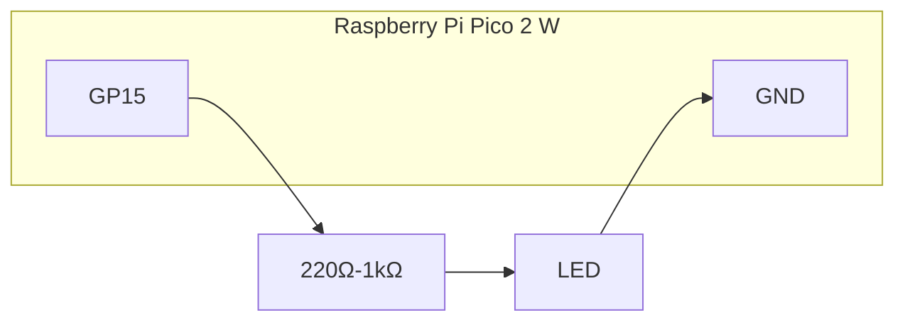

# IoTセキュリティ演習 1

## この資料について

この資料は、元の `prosecit-20251221IoT.pdf` をもとに、IoT 演習パートを Markdown に作り直したものです。今回はマイコンを `Raspberry Pi Pico 2 W with headers` 前提に置き換え、環境センサは `BMP280 + AHT20` を使う構成に整理しています。

> 注記  
> 2026年5月3日時点の Raspberry Pi の公式表記では `Raspberry Pi Pico 2 W with headers` が正式名称です。元の依頼に合わせて会話上は `Pico 2 WH` と呼ぶことがありますが、この資料内では公式に近い表記を使います。

この第1版では、IoT 演習のところまでを対象にし、次の項目を含みます。

- 開発環境の準備
- マイコンの基本
- GPIO の基本演習
- I2C センサの利用
- Wi-Fi 接続
- Ambient へのデータ送信と可視化

次の項目は今回の生成対象から外しています。

- Arpspoof の演習
- 8 ビットマイコン / アセンブラ演習

### 受講環境について

この演習は、`Windows` でも `macOS` でも受講できます。ただし、社会人向け研修では会社貸与 PC の制約で途中で止まりやすいため、次の条件を満たしていることを事前に確認してください。

- 利用者権限または管理者権限でソフトウェアをインストールできること
- USB インターフェースを利用できること
- 外部ネットワークへの接続に制限がないこと

特に次の操作ができないと演習継続が難しくなります。

- Arduino IDE や追加ライブラリのインストール
- Pico 2 W の USB 接続とシリアルポート利用
- ライブラリ取得や Ambient への接続

---

## 1. この講義でやること

この演習では、マイコンを「小さなネットワーク接続コンピュータ」として扱います。単に LED を点滅させるだけでなく、センサ値を読み、Wi-Fi に接続し、外部サービスに送信するところまでを一通り体験します。

到達目標は次のとおりです。

- マイコンの基本構造を説明できる
- Arduino IDE から Pico 2 W にスケッチを書き込める
- デジタル入出力を使って LED とボタンを扱える
- I2C センサから温度、湿度、気圧を取得できる
- Wi-Fi 経由で外部サービスへデータを送信できる
- Ambient 上で測定値を可視化できる

---

## 2. 必要なもの

最低限、次のものを用意してください。

- Raspberry Pi Pico 2 W with headers
- USB ケーブル
- ブレッドボード
- ジャンパワイヤ
- LED 1 個
- 抵抗器 220Ω から 1kΩ を 1 本
- タクトスイッチ 1 個
- BMP280 モジュール
- AHT20 モジュール
- インターネット接続できる PC
- 2.4GHz 帯の Wi-Fi

あると便利なものです。

- テスター
- 予備のジャンパワイヤ
- 10kΩ 抵抗
- 可変抵抗や CdS センサ

---

## 3. 事前準備

### 3.1 Arduino IDE のインストール

Arduino IDE 2 系をインストールします。

- 公式サイト: <https://www.arduino.cc/en/software>

Windows ではストア版よりも通常版の利用を勧めます。Pico 系ボードの検出で問題が出ることがあります。

### 3.2 Pico 系ボード定義の追加

Windows では Arduino IDE の `File -> Preferences` から設定を開きます。  
Mac では `Arduino IDE -> Settings` から設定を開きます。

`Additional Boards Manager URLs` は複数行を記入できます。今回使う URL は **一番最初の行** に入れてください。

```text
https://github.com/earlephilhower/arduino-pico/releases/download/global/package_rp2040_index.json
```

その後、`Tools -> Board -> Boards Manager` を開き、`pico` で検索します。今回インストールする対象は、`Arduino-Pico` という通称ではなく、実際の画面上では次のような名前で表示されることがあります。

- `Raspberry Pi Pico/RP2040/RP2350 by Earle F. Philhower, III`

この項目が見つかったら、`Install` または `Add` を選んでインストールしてください。すでにインストール済みの場合でも `UPDATE` が表示されることがあります。その場合は、可能なら最新版へ更新してください。

検索結果に `Arduino-Pico` という文字列がそのまま出ない場合があります。そのときは次の語でも検索してください。

- `RP2040`
- `RP2350`
- `Earle Philhower`
- `Raspberry Pi Pico`

現行の Arduino IDE では、今回の対象パッケージは `Raspberry Pi Pico/RP2040` のように途中までしか見えないことがありますが、作成者名が `Earle F. Philhower, III` であれば正しい候補です。

それでも出てこない場合は、次を順に確認してください。

1. `Additional Boards Manager URLs` の先頭行に  
   `https://github.com/earlephilhower/arduino-pico/releases/download/global/package_rp2040_index.json`  
   が正しく入っているか
2. URL の前後に余計な空白や全角文字が入っていないか
3. 設定を保存したあとに Boards Manager をいったん閉じて開き直したか
4. Arduino IDE を再起動したか
5. GitHub へのアクセス制限やプロキシ制限がないか

特に企業ネットワークでは、GitHub へのアクセス制限が原因でボード一覧が取得できないことがあります。

### 3.3 ボードの選択

ボードは `Tools -> Board` から `Raspberry Pi Pico 2 W` を選択してください。

初回書き込み時は次の流れが確実です。

1. Pico の `BOOTSEL` ボタンを押しながら USB 接続する
2. `Tools -> Port` から、初回書き込み用のボードを選ぶ
3. スケッチを書き込む
4. 書き込み後、通常のシリアルポートを選び直す

Mac では、通常のシリアルポートは次のような名前で見えることがあります。

- `/dev/cu.usbserial-0001`
- `/dev/cu.usbmodem...`

この通常ポートを、シリアルモニタ利用時や 2 回目以降の書き込み時に選んでください。

`UF2 Board` は、初回のブートローダモードで一時的に見える場合がありますが、Mac では常にその名前になるとは限りません。受講者には、**通常は `/dev/cu.*` のポートを選ぶ** と案内してください。

### 3.4 ライブラリの追加

今回の演習では、少なくとも次のライブラリを使います。

- `Adafruit BMP280 Library`
- `Adafruit AHTX0`

どちらも `Tools -> Manage Libraries` からインストールできます。依存ライブラリのインストールを聞かれたら追加してください。

### 3.5 シリアルモニタ

演習中の確認はシリアルモニタ中心で行います。基本は `115200 baud` にそろえます。

Mac では、ポート名として `/dev/cu.usbserial-0001` のような項目が見えることがあります。これが選べれば問題ありません。

### 3.6 Windows と Mac の違い

受講者がつまずきやすい点を、最初に表で整理しておきます。

| 項目 | Windows | Mac |
|---|---|---|
| 設定画面の開き方 | `File -> Preferences` | `Arduino IDE -> Settings` |
| `Additional Boards Manager URLs` | 設定画面内で編集 | 設定画面内で編集 |
| URL の入力 | 複数行入力可 | 複数行入力可 |
| 今回の URL の位置 | 先頭行に入れる | 先頭行に入れる |
| ボードマネージャ検索語 | `pico`, `RP2040`, `RP2350` など | `pico`, `RP2040`, `RP2350` など |
| 表示名の例 | `Raspberry Pi Pico/RP2040/RP2350 by Earle F. Philhower, III` | 同左 |
| 通常のシリアルポート名の例 | `COM3`, `COM4` など | `/dev/cu.usbserial-0001`, `/dev/cu.usbmodem...` など |
| 初回書き込み時の見え方 | 書き込み先が通常と異なることがある | `UF2 Board` または通常と異なるポート名で見えることがある |
| シリアルモニタで選ぶポート | `COM?` | `/dev/cu.*` |

授業中に迷ったら、まず次の観点で切り分けると進めやすいです。

- 設定画面の場所が OS により違う
- ポート名の表記が OS により違う
- しかし、インストールするボードパッケージ自体は同じ

---

## 4. マイコンとは何か

マイコンは、小さなコンピュータです。見た目は小さくても、計算、制御、記憶、入力、出力の要素を持っています。

ふつうの PC と違うのは、入出力がキーボードや画面ではなく、ピンとして外に出ていることです。これにより、LED、スイッチ、センサ、モータなどと直接つなげます。

この講義では、マイコンを次のようなものとして扱います。

- センサ値を読む
- 状態に応じて出力を変える
- ネットワークへ接続する
- 外部サービスにデータを送る

---

## 5. 最初の書き込み

まずは、PC から Pico へスケッチを書き込めることを確認します。

### 5.1 Hello over Serial

新しいスケッチを作成して、次のコードを書き込みます。

```cpp
void setup() {
  Serial.begin(115200);
  delay(2000);
  Serial.println("Pico 2 W ready");
}

void loop() {
  Serial.println("hello");
  delay(1000);
}
```

シリアルモニタに 1 秒ごとに `hello` が表示されれば成功です。

---

## 6. GPIO の基本

### 6.1 L チカ

最初の演習は LED の点滅です。外付け LED を使うと GPIO の意味が分かりやすくなります。

### 6.2 配線

次のように接続します。

- `GP15` -> 抵抗 -> LED アノード
- LED カソード -> `GND`

Pico 2 W 上で今回使う実ピンは次の通りです。

| 信号名 | 物理ピン番号 | 位置 |
|---|---:|---|
| `GP15` | 20 | 左側いちばん下 |
| `GND` | 18 | 左側の下から 3 番目 |

より正確な全体配置を確認したい場合は、Raspberry Pi 公式データシートも参照してください。

- 公式データシート: <https://pip-assets.raspberrypi.com/categories/1088-raspberry-pi-pico-2-w/documents/RP-008304-DS-2-pico-2-w-datasheet.pdf?disposition=inline>

特に **6ページのレイアウト図** を見ながら、今回の `GP15` と `GND` の位置を照らし合わせてください。

左側の下半分だけ抜き出すと、次の位置関係になります。

```text
USB コネクタ側
  :
  14  GP10
  15  GP11
  16  GP12
  17  GP13
  18  GND   ← LED の短い足をつなぐ
  19  GP14
  20  GP15  ← 抵抗を介して LED の長い足をつなぐ
アンテナ側
```

今回使う部分だけ抜き出した配線イメージは次のようになります。



この図は授業用の簡略図です。Pico 2 W 全体のピン配置ではなく、**物理ピン 20 の `GP15` と、物理ピン 18 の `GND`** を使うことを示しています。

LED には極性があります。長い足をアノード、短い足をカソードとして扱います。

### 6.3 スケッチ

```cpp
const int LED_PIN = 15;

void setup() {
  pinMode(LED_PIN, OUTPUT);
}

void loop() {
  digitalWrite(LED_PIN, HIGH);
  delay(250);
  digitalWrite(LED_PIN, LOW);
  delay(250);
}
```

LED が点滅すれば成功です。

### 6.4 `setup()` と `loop()`

Arduino スケッチでは、主に次の 2 つの関数を使います。

- `setup()`
  - 起動時に 1 回だけ実行される
- `loop()`
  - その後ずっと繰り返し実行される

この構造は、センサの周期取得やネットワーク送信のような処理とも相性がよいです。

---

## 7. ボタン入力

### 7.1 ねらい

入力ピンの状態を読んで、出力を変える練習をします。

### 7.2 配線

今回は内部プルアップを使うので、回路を簡単にできます。

- ボタン片側 -> `GP14`
- ボタン反対側 -> `GND`
- LED は前節と同じ

`INPUT_PULLUP` を使うと、ボタンを押していないときは `HIGH`、押したときは `LOW` になります。

### 7.3 スケッチ

```cpp
const int LED_PIN = 15;
const int BUTTON_PIN = 14;

void setup() {
  pinMode(LED_PIN, OUTPUT);
  pinMode(BUTTON_PIN, INPUT_PULLUP);
}

void loop() {
  int pressed = digitalRead(BUTTON_PIN);

  if (pressed == LOW) {
    digitalWrite(LED_PIN, HIGH);
  } else {
    digitalWrite(LED_PIN, LOW);
  }
}
```

### 7.4 ポイント

- `digitalRead(pin)` で入力を読む
- `if` 文で条件分岐する
- プルアップでは論理が反転する

---

## 8. アナログ入力

### 8.1 何に使うか

アナログ入力は、連続的に変わる電圧を読むために使います。たとえば次のようなセンサで使います。

- 可変抵抗
- 一部のガスセンサや光センサ
- LED を受光素子として使う簡易光センサ回路

### 8.2 Pico 2 W の ADC

Pico 系では ADC 入力として使えるピンがあります。代表的には次を使うと分かりやすいです。

- `GP26` = `A0`
- `GP27` = `A1`
- `GP28` = `A2`

### 8.3 今回の回路

今回は `CdS` センサの代わりに、LED を簡易的な光アナログセンサとして使います。LED は発光素子ですが、逆向きや高抵抗との組み合わせで、受けた光の強さに応じて微小な電圧変化を観察できます。

授業では、次のような回路で試します。

- `3V3(OUT)` -> 高抵抗 `10MΩ` 前後 -> `A0`
- `A0` -> LED カソード
- LED アノード -> `GND`

このとき、**LED の足の長い方を `GND` 側、短い方を `A0` 側** に接続してください。

使う LED は、L チカで使ったものとは別にしても構いません。周囲を手で覆ったときと、スマートフォンのライトなどを近づけたときで値が変わるかを見ます。

### 8.4 回路の考え方

この回路では、高抵抗を通して ADC ピンをゆっくり引き上げつつ、LED を受光素子として使ったときの微小な変化を読み取ります。L チカのときとは逆向きになるため、配線方向に注意してください。

### 8.5 なぜ逆向きに近い配線で使うのか

LED は発光素子ですが、中身はダイオードなので、光を受けるとごく小さな電流や電圧変化を生じます。これは LED の `pn 接合` に光が当たることで、内部に電子と正孔が生まれるためです。

L チカでは、LED に順方向の電流を流して発光させます。一方で、光センサとして使うときは、LED 自身が作る微小な変化を読みたいので、順方向に強く電流を流す向きでは都合がよくありません。

今回の回路のように、**長い足を `GND` 側、短い足を `A0` 側** にすると、LED が受けた光による微小な変化を ADC 側で観察しやすくなります。言い換えると、発光させる向きではなく、**受光による微小信号を取り出しやすい向き** にしている、ということです。

厳密な光センサとしてはフォトダイオードやフォトトランジスタのほうが適していますが、この演習では

- LED もダイオードであること
- ダイオードは光でも応答すること
- 配線の向きで振る舞いが変わること

を体験するのが目的です。

ポイントは次の通りです。

- 電流は非常に小さい
- 変化量も大きくはない
- 明るさの絶対値を厳密に測るというより、明暗の差を見る演習として扱う

そのため、周囲の照明条件によって値が変わります。測定時は、同じ場所で

- 手で覆う
- 室内光にさらす
- スマートフォンのライトを近づける

のように条件を変えて比較してください。

### 8.6 最小サンプル

```cpp
const int ANALOG_PIN = A0;

void setup() {
  Serial.begin(115200);
  delay(2000);
}

void loop() {
  int value = analogRead(ANALOG_PIN);
  Serial.println(value);
  delay(500);
}
```

### 8.7 観察ポイント

次の 3 条件で値を比較してください。

1. LED を手で覆ったとき
2. 室内光だけのとき
3. スマートフォンのライトを近づけたとき

値が大きく変わらない場合は、次を確認してください。

- 抵抗値が `10MΩ` 前後になっているか
- LED の向きが資料どおりか
- ADC ピンが `A0` になっているか
- サンプリング間隔が短すぎないか

この演習は任意です。今回の本命センサは I2C なので、時間がなければ次へ進んで構いません。

---

## 9. I2C センサ

### 9.1 I2C とは

I2C は、マイコンと周辺機器を少ない配線で接続するための通信方式です。基本は次の 2 本です。

- `SDA`
  - データ線
- `SCL`
  - クロック線

加えて、電源と GND をつなぎます。

### 9.2 今回使うセンサ

今回の構成では、1 個のセンサで全部まかなうのではなく、2 つのセンサを組み合わせます。

- `BMP280`
  - 温度
  - 気圧
- `AHT20`
  - 温度
  - 湿度

この構成にすると、気圧は BMP280、湿度は AHT20 から読み取れます。温度は両方から読めるので、比較にも使えます。

### 9.3 配線

I2C はバス接続なので、2 つのセンサを同じ SDA/SCL にぶら下げます。

#### Pico 2 W 側の割り当て

この資料では次のように固定します。

- `GP4` -> `SDA`
- `GP5` -> `SCL`
- `3V3(OUT)` -> `VCC` / `VIN`
- `GND` -> `GND`

#### BMP280

- `VCC` -> `3V3(OUT)`
- `GND` -> `GND`
- `SDA` -> `GP4`
- `SCL` -> `GP5`
- `CSB` -> 未接続
- `SDO` -> 未接続

#### AHT20

- `VCC` -> `3V3(OUT)`
- `GND` -> `GND`
- `SDA` -> `GP4`
- `SCL` -> `GP5`

### 9.4 I2C スキャナ

配線が不安なときは、まず I2C スキャナで見えるアドレスを確認します。

```cpp
#include <Wire.h>

void setup() {
  Serial.begin(115200);
  delay(2000);

  Wire.setSDA(4);
  Wire.setSCL(5);
  Wire.begin();

  Serial.println("I2C scanner start");
}

void loop() {
  for (byte addr = 1; addr < 127; addr++) {
    Wire.beginTransmission(addr);
    if (Wire.endTransmission() == 0) {
      Serial.print("Found: 0x");
      Serial.println(addr, HEX);
    }
  }
  Serial.println("---");
  delay(3000);
}
```

一般的には次のようなアドレスが見えます。

- BMP280: `0x76` または `0x77`
- AHT20: `0x38`

### 9.5 センサ単体の確認

ライブラリ付属のサンプルで確認しても構いませんが、Pico 2 W では I2C ピンを明示したほうが分かりやすいので、ここでは最初から最小コードを示します。

```cpp
#include <Wire.h>
#include <Adafruit_BMP280.h>
#include <Adafruit_AHTX0.h>

Adafruit_BMP280 bmp;
Adafruit_AHTX0 aht;

void setup() {
  Serial.begin(115200);
  delay(2000);

  Wire.setSDA(4);
  Wire.setSCL(5);
  Wire.begin();

  if (!bmp.begin(0x76)) {
    Serial.println("BMP280 not found at 0x76");
    while (1) {
      delay(100);
    }
  }

  if (!aht.begin()) {
    Serial.println("AHT20 not found");
    while (1) {
      delay(100);
    }
  }

  Serial.println("Sensors ready");
}

void loop() {
  sensors_event_t humidity, temp;
  aht.getEvent(&humidity, &temp);

  Serial.print("BMP temp [C]: ");
  Serial.println(bmp.readTemperature());

  Serial.print("BMP pressure [hPa]: ");
  Serial.println(bmp.readPressure() / 100.0);

  Serial.print("AHT temp [C]: ");
  Serial.println(temp.temperature);

  Serial.print("AHT humidity [%]: ");
  Serial.println(humidity.relative_humidity);

  Serial.println();
  delay(2000);
}
```

BMP280 の I2C アドレスが `0x76` でない場合は `0x77` に変えて試してください。

---

## 10. Wi-Fi 接続

### 10.1 Pico 2 W の Wi-Fi

Pico 2 W の無線は 2.4GHz 帯を使います。演習では、まずアクセスポイントに接続できることを確認します。

### 10.2 サンプル

```cpp
#include <WiFi.h>

const char* SSID = "YOUR_SSID";
const char* PASSWORD = "YOUR_PASSWORD";

void setup() {
  Serial.begin(115200);
  delay(2000);

  Serial.print("Connecting to Wi-Fi");
  WiFi.begin(SSID, PASSWORD);

  while (WiFi.status() != WL_CONNECTED) {
    delay(500);
    Serial.print(".");
  }

  Serial.println();
  Serial.println("Wi-Fi connected");
  Serial.print("IP address: ");
  Serial.println(WiFi.localIP());
}

void loop() {
  delay(1000);
}
```

接続できないときは、まず次を確認してください。

- 2.4GHz の SSID を使っているか
- SSID とパスワードにタイプミスがないか
- 電源供給が不安定でないか

---

## 11. Ambient で可視化する

### 11.1 Ambient とは

Ambient は、IoT データを受け取ってグラフ表示できるサービスです。

- サイト: <https://ambidata.io/>

まずユーザー登録し、チャネルを 1 つ作成してください。演習では少なくとも次を控えます。

- チャネル ID
- ライトキー

### 11.2 Pico 2 W での送信方針

元の資料では `ESP32 / ESP8266` 向け Ambient ライブラリを使う流れになっていましたが、Pico 2 W では HTTP POST で直接送るほうが扱いやすいです。

送信先は次の形式です。

```text
http://ambidata.io/api/v2/channels/チャネルID/data
```

送る JSON は次の形です。

```json
{
  "writeKey": "ライトキー",
  "d1": 24.8,
  "d2": 51.2,
  "d3": 1008.5
}
```

ここでは次の対応にします。

- `d1`: 温度
- `d2`: 湿度
- `d3`: 気圧

### 11.3 センサ + Wi-Fi + Ambient の統合サンプル

```cpp
#include <Wire.h>
#include <WiFi.h>
#include <Adafruit_BMP280.h>
#include <Adafruit_AHTX0.h>

const char* SSID = "YOUR_SSID";
const char* PASSWORD = "YOUR_PASSWORD";

const char* HOST = "ambidata.io";
const int PORT = 80;
const char* CHANNEL_ID = "YOUR_CHANNEL_ID";
const char* WRITE_KEY = "YOUR_WRITE_KEY";

Adafruit_BMP280 bmp;
Adafruit_AHTX0 aht;
WiFiClient client;

void connectWiFi() {
  if (WiFi.status() == WL_CONNECTED) {
    return;
  }

  Serial.print("Connecting to Wi-Fi");
  WiFi.begin(SSID, PASSWORD);

  while (WiFi.status() != WL_CONNECTED) {
    delay(500);
    Serial.print(".");
  }

  Serial.println();
  Serial.println("Wi-Fi connected");
}

bool sendToAmbient(float temperature, float humidity, float pressure) {
  String body = "{";
  body += "\"writeKey\":\"" + String(WRITE_KEY) + "\",";
  body += "\"d1\":" + String(temperature, 2) + ",";
  body += "\"d2\":" + String(humidity, 2) + ",";
  body += "\"d3\":" + String(pressure, 2);
  body += "}";

  if (!client.connect(HOST, PORT)) {
    Serial.println("Ambient connection failed");
    return false;
  }

  String path = "/api/v2/channels/" + String(CHANNEL_ID) + "/data";

  client.print("POST " + path + " HTTP/1.1\r\n");
  client.print("Host: " + String(HOST) + "\r\n");
  client.print("Content-Type: application/json\r\n");
  client.print("Connection: close\r\n");
  client.print("Content-Length: " + String(body.length()) + "\r\n");
  client.print("\r\n");
  client.print(body);

  unsigned long start = millis();
  while (!client.available() && millis() - start < 5000) {
    delay(10);
  }

  while (client.available()) {
    Serial.write(client.read());
  }

  client.stop();
  return true;
}

void setup() {
  Serial.begin(115200);
  delay(2000);

  Wire.setSDA(4);
  Wire.setSCL(5);
  Wire.begin();

  if (!bmp.begin(0x76)) {
    Serial.println("BMP280 not found");
    while (1) {
      delay(100);
    }
  }

  if (!aht.begin()) {
    Serial.println("AHT20 not found");
    while (1) {
      delay(100);
    }
  }

  connectWiFi();
}

void loop() {
  sensors_event_t humidityEvent, tempEvent;
  aht.getEvent(&humidityEvent, &tempEvent);

  float temperature = tempEvent.temperature;
  float humidity = humidityEvent.relative_humidity;
  float pressure = bmp.readPressure() / 100.0;

  Serial.print("Temperature [C]: ");
  Serial.println(temperature);
  Serial.print("Humidity [%]: ");
  Serial.println(humidity);
  Serial.print("Pressure [hPa]: ");
  Serial.println(pressure);

  sendToAmbient(temperature, humidity, pressure);

  // Ambient は短すぎる送信間隔だと受信されないことがあるので、
  // 演習では 10 秒以上あけておくと扱いやすいです。
  delay(10000);
}
```

### 11.4 Ambient 側の確認

データが送れたら Ambient のチャネル画面を開き、グラフを追加してください。

おすすめの割り当ては次の通りです。

- `d1`: 温度
- `d2`: 湿度
- `d3`: 気圧

まずはリスト表示で受信できているかを確認し、その後に折れ線グラフへ切り替えると分かりやすいです。

---

## 12. 演習課題

### 演習 1

L チカを成功させてください。

### 演習 2

ボタンを押したときだけ LED が点灯するようにしてください。

### 演習 3

I2C スキャナで、BMP280 と AHT20 のアドレスを確認してください。

### 演習 4

BMP280 と AHT20 の値をシリアルモニタに表示してください。

### 演習 5

Wi-Fi に接続し、IP アドレスを表示してください。

### 演習 6

Ambient に温度、湿度、気圧を送信し、チャートで確認してください。

---

## 13. うまくいかないときの確認項目

### 書き込みできない

- 初回は `BOOTSEL` 押下で接続したか
- 正しい書き込み先またはシリアルポートを選んだか
- USB ケーブルが給電専用でないか
- Mac の場合、`/dev/cu.usbserial-0001` や `/dev/cu.usbmodem...` を選べるか

### センサが見つからない

- `3V3` と `GND` が逆になっていないか
- `SDA` と `SCL` が逆でないか
- `Wire.setSDA(4)` と `Wire.setSCL(5)` を忘れていないか
- BMP280 のアドレスが `0x76` か `0x77` か

### Wi-Fi につながらない

- 2.4GHz の AP を使っているか
- SSID / パスワードが正しいか
- USB 電源が弱くないか

### Ambient に出ない

- `CHANNEL_ID` と `WRITE_KEY` が正しいか
- 送信間隔が短すぎないか
- シリアルモニタに HTTP 応答が出ているか

---

## 14. まとめ

この演習では、Pico 2 W を使って次の流れを一通り体験しました。

1. Arduino IDE からマイコンへ書き込む
2. GPIO で LED とボタンを扱う
3. I2C で BMP280 と AHT20 を読む
4. Wi-Fi に接続する
5. Ambient に送信して可視化する

ここまでできれば、IoT 端末の基本形は作れています。次に機能を増やすとしたら、次の方向が自然です。

- 送信失敗時の再送
- 深夜や一定間隔での省電力動作
- HTTPS 化
- データ改ざんや盗み見への対策

この続きとして、別資料でネットワーク観測やセキュリティ演習を追加できます。

---

## 15. 演習課題と提出条件

### 課題 A: GPIO と入力

次の動作を 1 本のスケッチで実装してください。

- 起動直後に LED が 3 回点滅する
- その後は、ボタンを押している間だけ LED が点灯する

### 課題 B: センサ読み取り

`BMP280 + AHT20` を接続し、シリアルモニタに次の 4 項目を 2 秒ごとに表示してください。

- BMP280 の温度
- BMP280 の気圧
- AHT20 の温度
- AHT20 の湿度

### 課題 C: Ambient 可視化

Ambient に次の 3 項目を送信してください。

- `d1`: 温度
- `d2`: 湿度
- `d3`: 気圧

Ambient 上で少なくとも 1 回以上データ受信が確認できることを条件とします。

### 提出物

提出時には次の 4 点をそろえてください。

1. 提出対象の `.ino` ファイル全文
2. 配線が分かる写真 1 枚
3. シリアルモニタの表示が分かるスクリーンショット 1 枚
4. Ambient のチャネル画面でデータが記録されていることが分かるスクリーンショット 1 枚

### 合格条件

次の条件をすべて満たしたものを完了とします。

- ソースコードがコンパイル可能である
- LED とボタンの動作が説明文通りである
- シリアルモニタに 4 項目の値が表示されている
- Ambient に少なくとも 1 回以上データが送信されている

### 提出時にコードへ必ず書くコメント

提出コードの先頭に、次の 3 点をコメントで明記してください。

- 使用した Wi-Fi 以外のハード構成
- BMP280 の I2C アドレス
- 温度として BMP280 と AHT20 のどちらを `d1` に送ったか
