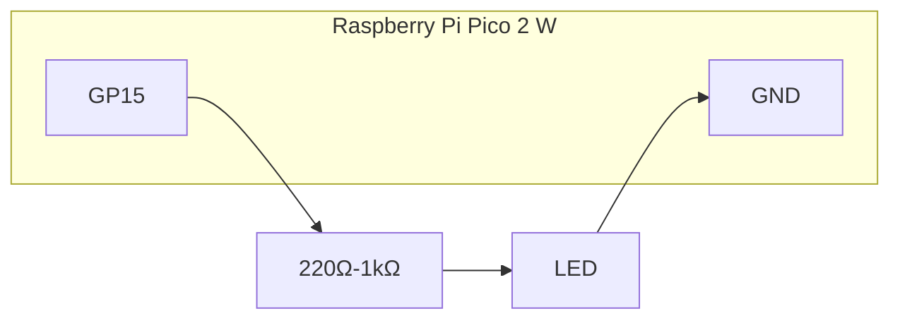
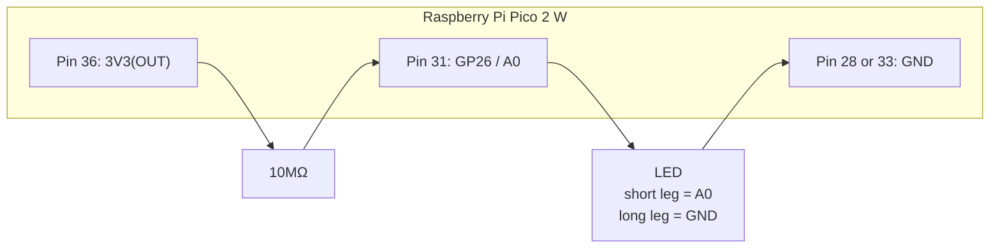
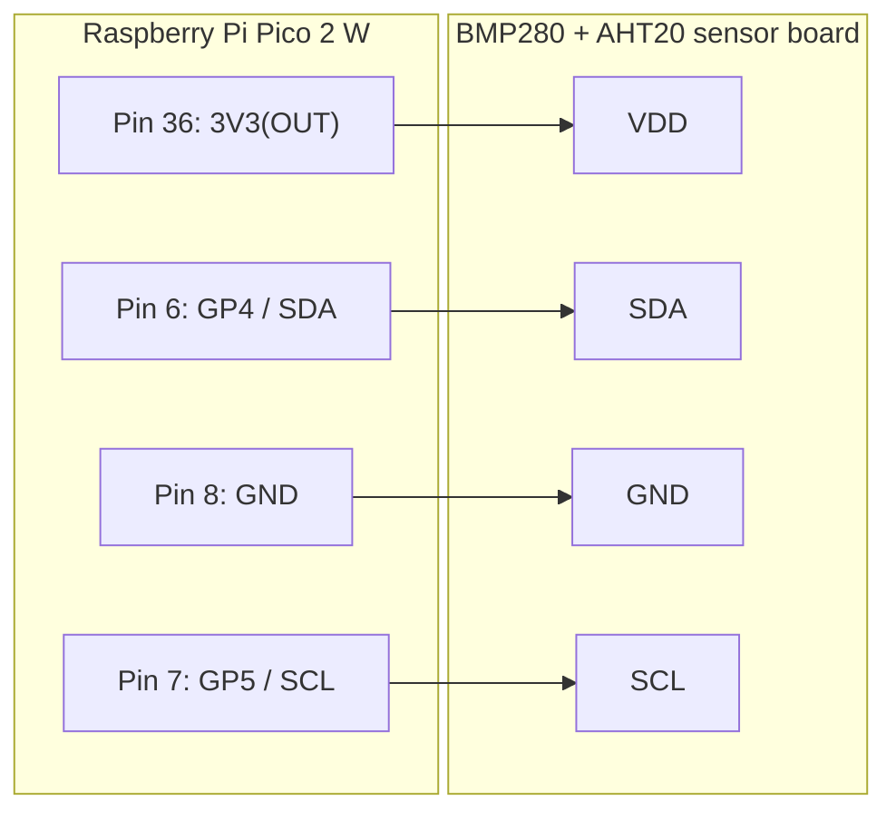

# IoT Security Hands-On 1

## About This Material

This material is a Markdown-first rebuild of the IoT hands-on part of the original `prosecit-20251221IoT.pdf`.

In this version:

- target board: `Raspberry Pi Pico 2 W with headers`
- sensor setup: `BMP280 + AHT20`
- scope: up to the IoT exercises

Included topics:

- environment setup
- microcontroller basics
- GPIO basics
- analog input
- I2C sensors
- Wi-Fi connection
- Ambient visualization

Excluded topics:

- Arpspoof exercise
- 8-bit microcontroller / assembler exercise

### Learner Environment Requirements

This hands-on can be taken on both `Windows` and `macOS`. However, especially on company-managed laptops, the following conditions must be satisfied in advance.

- you can install software with user or administrator privileges
- you can use the USB interface
- your network can access required external services

In particular, the following must work:

- installing Arduino IDE and additional libraries
- connecting Pico 2 W over USB and using the serial port
- accessing GitHub and Ambient

---

## 1. What We Will Do

In this session, we treat the microcontroller as a small network-connected computer. We do not stop at blinking an LED. We also read sensor values, connect to Wi-Fi, and send data to an external service.

By the end, learners should be able to:

- explain the basic structure of a microcontroller
- upload sketches from Arduino IDE to Pico 2 W
- use digital input and output with an LED and a tact switch
- read temperature, humidity, and pressure from I2C sensors
- send data over Wi-Fi
- visualize the measured values on Ambient

---

## 2. What You Need

- Raspberry Pi Pico 2 W with headers
- USB cable
- breadboard
- jumper wires
- 1 LED
- 1 resistor between 220 ohms and 1 kohm
- 1 tact switch
- BMP280 + AHT20 sensor module
- PC with internet access
- 2.4 GHz Wi-Fi

Useful extras:

- tester / multimeter
- spare jumper wires
- 10 megaohm resistor

---

## 3. Preparation

### 3.1 Install Arduino IDE

Install Arduino IDE 2.x.

- Official site: <https://www.arduino.cc/en/software>

On Windows, the standard installer is usually safer than the store version for board detection.

### 3.2 Add the Pico Board Package

On Windows, open settings from `File -> Preferences`.  
On macOS, open settings from `Arduino IDE -> Settings`.

`Additional Boards Manager URLs` accepts multiple lines. Put the following URL on the **first line**.

```text
https://github.com/earlephilhower/arduino-pico/releases/download/global/package_rp2040_index.json
```

Then open `Tools -> Board -> Boards Manager` and search for `pico`.

The package may appear under the following display name:

- `Raspberry Pi Pico/RP2040/RP2350 by Earle F. Philhower, III`

If searching for `pico` does not help, also try:

- `RP2040`
- `RP2350`
- `Earle Philhower`
- `Raspberry Pi Pico`

If it is already installed, you may see an `UPDATE` button. If possible, update to the latest version.

If the package does not appear:

1. confirm that the URL above is entered correctly on the first line
2. confirm there are no extra spaces or full-width characters
3. close and reopen Boards Manager
4. restart Arduino IDE
5. check whether GitHub access is blocked by the network

### 3.3 Select the Board

Choose `Raspberry Pi Pico 2 W` from `Tools -> Board`.

For the first upload, this flow is reliable:

1. hold the `BOOTSEL` button while connecting USB
2. choose the temporary upload target from `Tools -> Port`
3. upload the sketch
4. after that, switch back to the normal serial port

On macOS, the normal serial port may look like:

- `/dev/cu.usbserial-0001`
- `/dev/cu.usbmodem...`

For normal serial monitor use and later uploads, choose the `/dev/cu.*` style port.

### 3.4 Install Libraries

Install at least the following libraries:

- `Adafruit BMP280 Library`
- `Adafruit AHTX0`

Install any dependencies when prompted.

### 3.5 Serial Monitor

Use the serial monitor at `115200 baud`.

### 3.6 Windows and Mac Differences

| Item | Windows | Mac |
|---|---|---|
| Settings location | `File -> Preferences` | `Arduino IDE -> Settings` |
| Boards URL field | inside settings | inside settings |
| Multi-line URL input | yes | yes |
| Current URL position | first line | first line |
| Search words | `pico`, `RP2040`, `RP2350` | `pico`, `RP2040`, `RP2350` |
| Package display example | `Raspberry Pi Pico/RP2040/RP2350 by Earle F. Philhower, III` | same |
| Typical serial port name | `COM3`, `COM4`, ... | `/dev/cu.usbserial-0001`, `/dev/cu.usbmodem...` |
| Serial monitor port | `COM?` | `/dev/cu.*` |

---

## 4. What Is a Microcontroller

A microcontroller is a small computer. It still has the major elements of computing: processing, control, memory, input, and output.

Unlike a PC, its input and output are exposed as pins. That makes it possible to connect LEDs, switches, sensors, motors, and more.

In this lecture we use the microcontroller to:

- read sensors
- change outputs based on input
- connect to a network
- send data to an external service

---

## 5. First Upload

Start by checking that you can upload a sketch from your PC to Pico.

### 5.1 Hello over Serial

```cpp
void setup() {
  Serial.begin(115200);
  delay(2000);
  Serial.println("Pico 2 W ready");
}

void loop() {
  Serial.println("hello");
  delay(1000);
}
```

If `hello` appears once per second in the serial monitor, the environment is working.

---

## 6. GPIO Basics

### 6.1 Blink

The first exercise is blinking an LED.

### 6.2 Wiring

- `GP15` -> resistor -> LED anode
- LED cathode -> `GND`

Pins used on Pico 2 W:

| Signal | Physical Pin | Location |
|---|---:|---|
| `GP15` | 20 | bottom-most pin on the left side |
| `GND` | 18 | third from the bottom on the left side |

Official datasheet:

- <https://pip-assets.raspberrypi.com/categories/1088-raspberry-pi-pico-2-w/documents/RP-008304-DS-2-pico-2-w-datasheet.pdf?disposition=inline>

Please also check the **layout on page 6** and match it with `GP15` and `GND`.

```text
Left side, lower section
14  GP10
15  GP11
16  GP12
17  GP13
18  GND   <- LED short leg
19  GP14
20  GP15  <- LED long leg through resistor
```



This is a simplified class diagram. It shows that the exercise uses **physical pin 20 for `GP15`** and **physical pin 18 for `GND`**.

The LED long leg is the anode and the short leg is the cathode.

### 6.3 Sketch

```cpp
const int LED_PIN = 15;

void setup() {
  pinMode(LED_PIN, OUTPUT);
}

void loop() {
  digitalWrite(LED_PIN, HIGH);
  delay(250);
  digitalWrite(LED_PIN, LOW);
  delay(250);
}
```

### 6.4 `setup()` and `loop()`

- `setup()`
  - runs once at startup
- `loop()`
  - runs repeatedly afterward

---

## 7. Tact Switch Input

### 7.1 Goal

Read an input pin and change the output based on its state.

### 7.2 Wiring

- one side of the tact switch -> `GP14`
- the opposite side -> `GND`
- LED stays the same as before

With `INPUT_PULLUP`, the input is `HIGH` when not pressed and `LOW` when pressed.

### 7.3 About the 4 Pins of a Tact Switch

A tact switch has 4 leads, but they are not four fully independent terminals.

The easy way to think about it is:

- there are two pairs of connected pins
- when not pressed, each pair is internally connected to itself
- when pressed, the two pairs connect together
- as a result, all 4 leads become connected while pressed

```text
Not pressed

  [A]---[B]

  [C]---[D]

A-B connected
C-D connected
upper and lower pairs not connected together

Pressed

  [A]---[B]
    |   |
  [C]---[D]

all four connected
```

So on a breadboard, connect **one pair to `GP14`** and the **opposite pair to `GND`**. If you accidentally use two leads from the same pair, the switch will behave as if it is always connected.

Helpful references with diagrams:

- [SparkFun: Button and Switch Basics](https://learn.sparkfun.com/tutorials/button-and-switch-basics/momentary-switches)
- [HX Switch: How to Identify Tact Switch Pinout](https://www.hx-switch.eu/how-to-identify-tact-switch-pinout/)

### 7.4 Sketch

```cpp
const int LED_PIN = 15;
const int BUTTON_PIN = 14;

void setup() {
  pinMode(LED_PIN, OUTPUT);
  pinMode(BUTTON_PIN, INPUT_PULLUP);
}

void loop() {
  int pressed = digitalRead(BUTTON_PIN);

  if (pressed == LOW) {
    digitalWrite(LED_PIN, HIGH);
  } else {
    digitalWrite(LED_PIN, LOW);
  }
}
```

### 7.5 Key Points

- use `digitalRead(pin)` to read the input
- use `if` for branching
- with pull-up logic, the pressed state is inverted

---

## 8. Analog Input

### 8.1 What It Is For

Analog input reads continuously changing voltages.

Examples:

- variable resistors
- some gas or light sensors
- an LED used as a simple light sensor

### 8.2 Pico 2 W ADC Pins

- `GP26` = `A0`
- `GP27` = `A1`
- `GP28` = `A2`

### 8.3 Circuit Used in This Class

This time, instead of a CdS photoresistor, we use an LED as a simple light sensor.

- `3V3(OUT)` -> `10MΩ` resistor -> `A0`
- `A0` -> LED cathode
- LED anode -> `GND`

Use the **long leg to `GND`** and the **short leg to `A0`**.

Pins used on Pico 2 W:

| Signal | Physical Pin | Location |
|---|---:|---|
| `A0` = `GP26` | 31 | tenth from the bottom on the right side |
| `GND` | 28 or 33 | available nearby on the right side |
| `3V3(OUT)` | 36 | fifth from the top on the right side |

Official datasheet:

- <https://pip-assets.raspberrypi.com/categories/1088-raspberry-pi-pico-2-w/documents/RP-008304-DS-2-pico-2-w-datasheet.pdf?disposition=inline>

Please also check the **layout on page 6** and match `GP26(A0)`, `GND`, and `3V3(OUT)`.

```text
Right side, upper-middle section
36  3V3(OUT)  <- to resistor
35  ADC_VREF
34  GP28
33  GND
32  GP27
31  GP26/A0   <- resistor and LED short leg node
30  RUN
29  GP22
28  GND       <- LED long leg may also connect here
```



### 8.4 Why the LED Is Used in the Reverse-Like Direction

An LED is also a diode. When light hits its `pn junction`, it can generate a tiny current or voltage change.

When we blink an LED, we drive it in the forward direction to emit light. When we use it as a sensor, we want to observe the tiny light-induced signal instead. That is why the orientation differs from the normal blink use case.

In this class setup, the **long leg goes to `GND`** and the **short leg goes to `A0`** so the ADC can more easily observe the very small light-dependent change.

### 8.5 Minimal Sketch

```cpp
const int ANALOG_PIN = A0;

void setup() {
  Serial.begin(115200);
  delay(2000);
}

void loop() {
  int value = analogRead(ANALOG_PIN);
  Serial.println(value);
  delay(500);
}
```

### 8.6 What to Observe

Compare the value under:

1. covering the LED with your hand
2. normal room light
3. shining a smartphone flashlight on it

If the value barely changes:

- check that the resistor is around `10MΩ`
- check the LED orientation
- check that the ADC pin is really `A0`

---

## 9. I2C Sensors

### 9.1 What I2C Is

I2C is a simple bus for connecting a microcontroller to peripherals. The basic lines are:

- `SDA`
- `SCL`

plus power and ground.

### 9.2 Sensor Module Used in This Class

We use a combined sensor board that contains both `BMP280` and `AHT20`.

The board exposes only:

- `VDD`
- `SDA`
- `GND`
- `SCL`

Internally:

- `BMP280`
  - temperature
  - pressure
- `AHT20`
  - temperature
  - humidity

### 9.3 Wiring

Pico 2 W mapping:

- `GP4` -> `SDA`
- `GP5` -> `SCL`
- `3V3(OUT)` -> `VDD`
- `GND` -> `GND`

Sensor board mapping:

- `VDD` -> `3V3(OUT)`
- `SDA` -> `GP4`
- `GND` -> `GND`
- `SCL` -> `GP5`

Pins used on Pico 2 W:

| Signal | Physical Pin | Location |
|---|---:|---|
| `GP4` | 6 | sixth from the top on the left side |
| `GP5` | 7 | seventh from the top on the left side |
| `GND` | 8 | eighth from the top on the left side |
| `3V3(OUT)` | 36 | fifth from the top on the right side |

Official datasheet:

- <https://pip-assets.raspberrypi.com/categories/1088-raspberry-pi-pico-2-w/documents/RP-008304-DS-2-pico-2-w-datasheet.pdf?disposition=inline>

Please also check the **layout on page 6** and match `GP4`, `GP5`, `GND`, and `3V3(OUT)`.

```text
Left upper side                       Right upper side
6   GP4    <- sensor SDA             36  3V3(OUT) <- sensor VDD
7   GP5    <- sensor SCL
8   GND    <- sensor GND
```



### 9.4 I2C Scanner

Use an I2C scanner if you want to confirm the wiring first.

```cpp
#include <Wire.h>

void setup() {
  Serial.begin(115200);
  delay(2000);

  Wire.setSDA(4);
  Wire.setSCL(5);
  Wire.begin();

  Serial.println("I2C scanner start");
}

void loop() {
  for (byte addr = 1; addr < 127; addr++) {
    Wire.beginTransmission(addr);
    if (Wire.endTransmission() == 0) {
      Serial.print("Found: 0x");
      Serial.println(addr, HEX);
    }
  }
  Serial.println("---");
  delay(3000);
}
```

Expected addresses:

- BMP280: `0x77`
- AHT20: `0x38`

### 9.5 Sensor Check

Use this minimal test. The BMP280 address is `0x77` in this class setup.

```cpp
#include <Wire.h>
#include <Adafruit_BMP280.h>
#include <Adafruit_AHTX0.h>

Adafruit_BMP280 bmp;
Adafruit_AHTX0 aht;

void setup() {
  Serial.begin(115200);
  delay(2000);

  Wire.setSDA(4);
  Wire.setSCL(5);
  Wire.begin();

  if (!bmp.begin(0x77)) {
    Serial.println("BMP280 not found at 0x77");
    while (1) { delay(100); }
  }

  if (!aht.begin()) {
    Serial.println("AHT20 not found");
    while (1) { delay(100); }
  }

  Serial.println("Sensors ready");
}

void loop() {
  sensors_event_t humidity, temp;
  aht.getEvent(&humidity, &temp);

  Serial.print("BMP temp [C]: ");
  Serial.println(bmp.readTemperature());

  Serial.print("BMP pressure [hPa]: ");
  Serial.println(bmp.readPressure() / 100.0);

  Serial.print("AHT temp [C]: ");
  Serial.println(temp.temperature);

  Serial.print("AHT humidity [%]: ");
  Serial.println(humidity.relative_humidity);

  Serial.println();
  delay(2000);
}
```

---

## 10. Wi-Fi Connection

Pico 2 W uses 2.4 GHz Wi-Fi.

```cpp
#include <WiFi.h>

const char* SSID = "YOUR_SSID";
const char* PASSWORD = "YOUR_PASSWORD";

void setup() {
  Serial.begin(115200);
  delay(2000);

  Serial.print("Connecting to Wi-Fi");
  WiFi.begin(SSID, PASSWORD);

  while (WiFi.status() != WL_CONNECTED) {
    delay(500);
    Serial.print(".");
  }

  Serial.println();
  Serial.println("Wi-Fi connected");
  Serial.print("IP address: ");
  Serial.println(WiFi.localIP());
}

void loop() {
  delay(1000);
}
```

---

## 11. Visualize with Ambient

Ambient is an IoT data visualization service.

- <https://ambidata.io/>

Register, create a channel, and note:

- channel ID
- write key

For this class we send data by HTTP POST directly.

```text
http://ambidata.io/api/v2/channels/CHANNEL_ID/data
```

```json
{
  "writeKey": "WRITE_KEY",
  "d1": 24.8,
  "d2": 51.2,
  "d3": 1008.5
}
```

Mapping:

- `d1`: temperature
- `d2`: humidity
- `d3`: pressure

### 11.3 Integrated Sample

```cpp
#include <Wire.h>
#include <WiFi.h>
#include <Adafruit_BMP280.h>
#include <Adafruit_AHTX0.h>

const char* SSID = "YOUR_SSID";
const char* PASSWORD = "YOUR_PASSWORD";

const char* HOST = "ambidata.io";
const int PORT = 80;
const char* CHANNEL_ID = "YOUR_CHANNEL_ID";
const char* WRITE_KEY = "YOUR_WRITE_KEY";

Adafruit_BMP280 bmp;
Adafruit_AHTX0 aht;
WiFiClient client;

void connectWiFi() {
  if (WiFi.status() == WL_CONNECTED) return;

  Serial.print("Connecting to Wi-Fi");
  WiFi.begin(SSID, PASSWORD);

  while (WiFi.status() != WL_CONNECTED) {
    delay(500);
    Serial.print(".");
  }

  Serial.println();
  Serial.println("Wi-Fi connected");
}

bool sendToAmbient(float temperature, float humidity, float pressure) {
  String body = "{";
  body += "\"writeKey\":\"" + String(WRITE_KEY) + "\",";
  body += "\"d1\":" + String(temperature, 2) + ",";
  body += "\"d2\":" + String(humidity, 2) + ",";
  body += "\"d3\":" + String(pressure, 2);
  body += "}";

  if (!client.connect(HOST, PORT)) {
    Serial.println("Ambient connection failed");
    return false;
  }

  String path = "/api/v2/channels/" + String(CHANNEL_ID) + "/data";

  client.print("POST " + path + " HTTP/1.1\r\n");
  client.print("Host: " + String(HOST) + "\r\n");
  client.print("Content-Type: application/json\r\n");
  client.print("Connection: close\r\n");
  client.print("Content-Length: " + String(body.length()) + "\r\n");
  client.print("\r\n");
  client.print(body);

  unsigned long start = millis();
  while (!client.available() && millis() - start < 5000) {
    delay(10);
  }

  while (client.available()) {
    Serial.write(client.read());
  }

  client.stop();
  return true;
}

void setup() {
  Serial.begin(115200);
  delay(2000);

  Wire.setSDA(4);
  Wire.setSCL(5);
  Wire.begin();

  if (!bmp.begin(0x77)) {
    Serial.println("BMP280 not found");
    while (1) { delay(100); }
  }

  if (!aht.begin()) {
    Serial.println("AHT20 not found");
    while (1) { delay(100); }
  }

  connectWiFi();
}

void loop() {
  sensors_event_t humidityEvent, tempEvent;
  aht.getEvent(&humidityEvent, &tempEvent);

  float temperature = tempEvent.temperature;
  float humidity = humidityEvent.relative_humidity;
  float pressure = bmp.readPressure() / 100.0;

  Serial.print("Temperature [C]: ");
  Serial.println(temperature);
  Serial.print("Humidity [%]: ");
  Serial.println(humidity);
  Serial.print("Pressure [hPa]: ");
  Serial.println(pressure);

  sendToAmbient(temperature, humidity, pressure);
  delay(10000);
}
```

### 11.4 Ambient Check

Confirm that the channel receives data and create charts for:

- `d1`: temperature
- `d2`: humidity
- `d3`: pressure

---

## 12. Practice Tasks

1. Make the LED blink.
2. Make the LED turn on only while the tact switch is pressed.
3. Use the I2C scanner and confirm the sensor addresses.
4. Print the BMP280 and AHT20 values to the serial monitor.
5. Connect to Wi-Fi and show the IP address.
6. Send temperature, humidity, and pressure to Ambient.

---

## 13. Troubleshooting

### Upload does not work

- did you use `BOOTSEL` for the first connection?
- did you choose the correct upload target or serial port?
- is the USB cable data-capable?
- on macOS, can you see `/dev/cu.usbserial-0001` or `/dev/cu.usbmodem...`?

### Sensor not found

- are `3V3` and `GND` correct?
- are `SDA` and `SCL` swapped?
- did you call `Wire.setSDA(4)` and `Wire.setSCL(5)`?
- are you using the expected BMP280 address `0x77`?

### Wi-Fi does not connect

- are you using a 2.4 GHz network?
- are the SSID and password correct?
- is USB power stable?

### Ambient does not show data

- are `CHANNEL_ID` and `WRITE_KEY` correct?
- is the sending interval too short?
- does the serial monitor show an HTTP response?

---

## 14. Summary

In this lecture, learners:

1. uploaded code from Arduino IDE
2. used GPIO with an LED and a tact switch
3. read BMP280 and AHT20 over I2C
4. connected Pico 2 W to Wi-Fi
5. sent data to Ambient

---

## 15. Assignment and Submission Requirements

### Task A: GPIO and Input

Implement one sketch with the following behavior:

- immediately after startup, blink the LED 3 times
- after that, the LED stays on only while the tact switch is pressed

### Task B: Sensor Reading

Using the `BMP280 + AHT20` module, print the following to the serial monitor every 2 seconds:

- BMP280 temperature
- BMP280 pressure
- AHT20 temperature
- AHT20 humidity

### Task C: Ambient Visualization

Send the following to Ambient:

- `d1`: temperature
- `d2`: humidity
- `d3`: pressure

At least one successful data record must be visible on Ambient.

### Submission Items

Submit all of the following:

1. the full `.ino` file
2. one photo of the wiring
3. one screenshot of the serial monitor
4. one screenshot of the Ambient channel showing received data

### Pass Criteria

All of the following must be satisfied:

- the code compiles
- LED and tact switch behavior matches the instructions
- the serial monitor shows all four sensor values
- Ambient shows at least one received data record

### Required Code Comment

At the top of the submitted code, add comments describing:

- the hardware configuration used
- the BMP280 I2C address
- which temperature source was sent as `d1`
