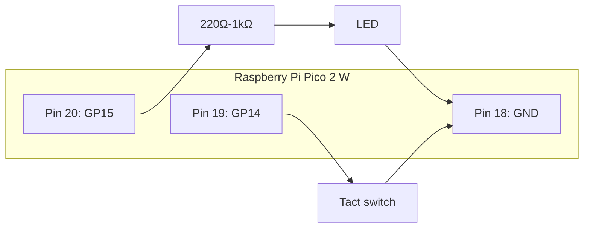

# 第2回 Cortex-M33 アセンブラハンズオン

## この資料の目的

この回では、`Raspberry Pi Pico 2 W with headers` の `Cortex-M33` を使って、アセンブラの基本を **実機ハンズオン** として体験します。

狙いは、抽象的に命令を覚えることではありません。次の 3 つを結び付けて理解することです。

- C の処理
- Cortex-M33 の命令
- LED とボタンの実機動作

今回は、別環境が必要な Linux 演習や ARM64 演習は扱いません。`Pico 2 W` と Arduino IDE だけで完結します。

---

## 1. 今日やること

この回の流れは次の通りです。

1. C 版 L チカで配線と書き込みを確認する
2. `.S` ファイルを含む最小プロジェクトを開く
3. 講師と一緒に `led_on_asm()` と `led_off_asm()` を完成させる
4. 個人演習で `led_toggle_asm()` を完成させる
5. `CBZ` でボタン押下判定を書く
6. `UBFX` / `BFI` / `RBIT` / `REV` / `CLZ` を確認する

### 先に読んでほしい資料

この回に入る前に、次の資料を先に読んでください。

- [第2.5回 Cortex-M33 アセンブラ超入門](lecture02a_cortex_m33_assembly_primer.md)

特に、`ldr`、`str`、`movs`、`orrs`、`bics`、`eors`、`cbz` の意味がまだ曖昧な場合は、先にこちらを読んでから進めてください。

---

## 2. 到達目標

この回の終了時点で、次のことができる状態を目指します。

- Arduino IDE で `.S` ファイルを含むプロジェクトをビルドできる
- C からアセンブラ関数を呼び出せる
- `EOR` を使って LED 状態を反転できる
- `CBZ` を使って 0 判定の分岐を書ける
- `UBFX` / `BFI` の意味を説明できる
- `RBIT` / `REV` / `CLZ` の結果を読み取れる

---

## 3. 必要なもの

この回で使うものは次の通りです。

- Raspberry Pi Pico 2 W with headers
- USB ケーブル
- ブレッドボード
- ジャンパワイヤ
- LED 1 個
- 抵抗器 220Ω から 1kΩ を 1 本
- タクトスイッチ 1 個
- Arduino IDE
- `Arduino-Pico` ボードパッケージ

---

## 4. 配線

### LED

- `GP15` -> 抵抗 -> LED アノード
- LED カソード -> `GND`

### タクトスイッチ

- タクトスイッチ片側 -> `GP14`
- 反対側 -> `GND`

ソフトウェア側では `INPUT_PULLUP` を使います。そのため、押していないときは `HIGH`、押したときは `LOW` になります。

### タクトスイッチの 4 端子について

今回使うタクトスイッチは 4 端子ですが、4 本が全部独立しているわけではありません。

- 押していないとき:
  - 向かい合う 2 本ずつが、それぞれ内部でつながっている
- 押したとき:
  - 2 つの組どうしもつながる
  - 結果として 4 本すべてが導通する

受講者が一番間違えやすいのは、**同じ組の 2 本に `GP14` と `GND` をつないでしまうこと** です。これをやると、押していなくても常につながった状態になります。

配線するときは、

- 片側の組を `GP14`
- 反対側の組を `GND`

にしてください。

参考になる図付きページ:

- [SparkFun: Button and Switch Basics](https://learn.sparkfun.com/tutorials/button-and-switch-basics/momentary-switches)
- [HX Switch: How to Identify Tact Switch Pinout](https://www.hx-switch.eu/how-to-identify-tact-switch-pinout/)

### Pico 2 W 上で今回使う実ピン

| 信号名 | 物理ピン番号 | 位置 |
|---|---:|---|
| `GP14` | 19 | 左側のいちばん下から 2 番目 |
| `GP15` | 20 | 左側のいちばん下 |
| `GND` | 18 | 左側の下から 3 番目 |

より正確な全体配置を確認したい場合は、Raspberry Pi 公式データシートも参照してください。

- 公式データシート: <https://pip-assets.raspberrypi.com/categories/1088-raspberry-pi-pico-2-w/documents/RP-008304-DS-2-pico-2-w-datasheet.pdf?disposition=inline>

特に **6ページのレイアウト図** を見ながら、今回の `GP14`、`GP15`、`GND` の位置を照らし合わせてください。

左側の下半分だけ抜き出すと、位置関係は次のようになります。

```text
左側下部
14  GP10
15  GP11
16  GP12
17  GP13
18  GND   ← LED の短い足 / タクトスイッチ片側ではない側
19  GP14  ← タクトスイッチ片側
20  GP15  ← 抵抗を介して LED の長い足
```

LED とボタンをまとめた配線イメージは次の通りです。



この図は授業用の簡略図です。重要なのは、**LED は `GP15` と `GND`、タクトスイッチは `GP14` と `GND` の間につなぐ** ことです。

---

## 5. 使う配布物

この回では、次の 2 種類のプロジェクトを配布します。

### 完成版

- [pico2w-cortexm33-asm-complete/README.md](../projects/pico2w-cortexm33-asm-complete/README.md)

講師デモや答え合わせ用です。

### 穴埋め版

- [pico2w-cortexm33-asm-worksheet/README.md](../projects/pico2w-cortexm33-asm-worksheet/README.md)

受講者は原則こちらを使います。

### 5.1 GitHub から取り込む場合

授業で GitHub リポジトリを配布する場合は、次のどちらかの方法で取り込みます。

#### 方法 A: `Download ZIP` を使う

1. 講師から指定された GitHub リポジトリをブラウザで開く
2. `Code` ボタンを押す
3. `Download ZIP` を選ぶ
4. ダウンロードした ZIP ファイルを展開する
5. 展開したフォルダの中から、今回使うプロジェクトフォルダを確認する

`git` に慣れていない受講者は、この方法で十分です。

#### 方法 B: `git clone` を使う

ターミナルが使える場合は、次のように取得できます。

```bash
git clone <講師が指定したGitHubリポジトリURL>
```

取得後、そのフォルダの中にある今回のプロジェクトを使います。

### 5.2 Arduino IDE で開くフォルダ

GitHub から取得したあとに Arduino IDE で開くのは、**リポジトリの一番上のフォルダ全体ではなく、今回使うスケッチのフォルダ** です。

たとえば今回の配布物であれば、次のどちらかを開きます。

- `pico2w-cortexm33-asm-complete`
- `pico2w-cortexm33-asm-worksheet`

### 5.3 開き方

Arduino IDE では、次の手順で開きます。

1. `File -> Open`
2. 使いたいプロジェクトフォルダを選ぶ
3. そのフォルダ名と同じ `.ino` ファイルを開く

フォルダを正しく開けると、同じフォルダにある

- フォルダ名と同じ `.ino`
- `asm_api.h`
- `led_asm.S`

がタブとして見えることがあります。

### 5.4 よくある失敗

- ZIP を展開せずにそのまま開こうとする
- リポジトリの親フォルダを開いてしまう
- フォルダ名と一致する `.ino` ではなく別のファイルだけを単独で開く
- `led_asm.S` の拡張子を変えてしまう

---

## 6. プロジェクト構成

穴埋め版プロジェクトの構成は次の通りです。

```text
pico2w-cortexm33-asm-worksheet/
  pico2w-cortexm33-asm-worksheet.ino
  asm_api.h
  led_asm.S
  README.md
```

それぞれの役割は次の通りです。

- `pico2w-cortexm33-asm-worksheet.ino`
  - GPIO 初期化
  - シリアル出力
  - ボタン入力
  - asm 関数呼び出し
- `asm_api.h`
  - C から呼ぶ関数宣言
- `led_asm.S`
  - 今回の演習本体

---

## 7. 事前確認

Arduino IDE で次を選んでください。

- Board: `Raspberry Pi Pico 2 W`
- CPU Architecture: `ARM Cortex-M33`

この回の `.S` ファイルは `RISC-V Hazard3` では動きません。CPU Architecture が `ARM Cortex-M33` になっていることを必ず確認してください。

---

## 8. ウォームアップ: C 版 L チカ

まずは配線と書き込みの問題を切り分けます。

新しいスケッチを作り、次のコードを書き込んでください。

```cpp
const int LED_PIN = 15;

void setup() {
  pinMode(LED_PIN, OUTPUT);
}

void loop() {
  digitalWrite(LED_PIN, HIGH);
  delay(300);
  digitalWrite(LED_PIN, LOW);
  delay(300);
}
```

LED が点滅すれば、配線と書き込みは正常です。ここで動かない場合は、asm に進む前に必ず修正してください。

---

## 9. 穴埋め版を開く

次に、穴埋め版プロジェクトの [pico2w-cortexm33-asm-worksheet.ino](../projects/pico2w-cortexm33-asm-worksheet/pico2w-cortexm33-asm-worksheet.ino) と [led_asm.S](../projects/pico2w-cortexm33-asm-worksheet/led_asm.S) を開いてください。

`.ino` ファイルには C 側の流れが書いてあります。今回受講者が主に編集するのは `led_asm.S` です。

### 9.1 `led_asm.S` はどこで編集するか

Arduino IDE は `.ino` の編集には向いていますが、`.S` ファイルの編集は VS Code などの外部エディタを使うほうが分かりやすいです。

おすすめは次のどちらかです。

- `VS Code`
- `テキストエディット` や `メモ帳` 以外のプレーンテキストエディタ

授業では、**Arduino IDE でビルドと書き込みを行い、`led_asm.S` は VS Code で編集する** 進め方を勧めます。

### 9.2 編集手順

1. Arduino IDE で穴埋め版プロジェクトの `pico2w-cortexm33-asm-worksheet.ino` を開く
2. Finder またはエクスプローラで、同じフォルダにある `led_asm.S` を探す
3. `led_asm.S` を `VS Code` で開く
4. `TODO` を 1 か所だけ埋める
5. 保存する
6. Arduino IDE に戻って `Verify` または `Upload` を実行する

このように、**編集は外部エディタ、ビルドと書き込みは Arduino IDE** と役割を分けると進めやすくなります。

### 9.3 ファイル拡張子に注意

`led_asm.S` の末尾は **大文字の `S`** です。小文字の `.s` に変えたり、`.txt` を付けてしまったりしないように注意してください。

特に次は避けてください。

- `led_asm.s`
- `led_asm.S.txt`
- `led_asm`

ファイル名が変わると、Arduino IDE 側で正しくアセンブラファイルとして扱われないことがあります。

---

## 10. まず読むべき C 側コード

`.ino` ファイルで見てほしい点は次の 3 つです。

1. `g_led_state` という 1 ビット相当の状態を持っている
2. asm 関数はその状態を書き換える
3. `apply_led_state()` がその状態を実際の LED に反映する

つまり今回は、**asm が状態を変え、C が実機へ反映する** という分担です。

この構成にすると、RP2350 の GPIO レジスタ詳細を知らなくても、命令の意味に集中できます。

---

## 11. `led_asm.S` の見方

`led_asm.S` には 9 個の関数があります。

1. `led_on_asm`
2. `led_off_asm`
3. `led_toggle_asm`
4. `should_toggle_on_press_asm`
5. `ubfx_demo_asm`
6. `bfi_demo_asm`
7. `rbit_demo_asm`
8. `rev_demo_asm`
9. `clz_demo_asm`

最初の 4 つが基本演習、残り 5 つが発展演習です。

---

## 12. 共同ハンズオン: 最初の 2 関数を一緒に作る

ここからは、講師と受講生が同じ画面を見ながら、一緒に 2 つの関数を完成させます。

この共同ハンズオンで扱うのは次の 2 つです。

- `led_on_asm()`
- `led_off_asm()`

この段階では、全員が

- `.S` ファイルを開ける
- 1 命令を書き換えられる
- ビルドと書き込みができる

状態になることを優先します。

### 共同ハンズオンの進め方

1. 講師が `led_asm.S` の該当箇所を表示する
2. 受講生は同じ箇所を開く
3. 1 行だけ命令を置き換える
4. 全員で保存する
5. Arduino IDE で `Verify` する
6. `Upload` して LED 動作を確認する

### この段階で講師が説明すること

- `r0` は `state` のアドレス
- `ldr` は読む
- `str` は書き戻す
- `movs r2, #1` は bit 0 用のマスク
- `orrs` は bit を立てる
- `bics` は bit を落とす

---

## 13. 共同ハンズオン 1: `led_on_asm()`

最初の目標は、`*state` の bit 0 を 1 にすることです。

穴埋め版では、次の形になっています。

```asm
ldr r1, [r0]
movs r2, #1
@ TODO: replace the next instruction with the correct one.
nop
str r1, [r0]
bx lr
```

ここで考えるべきことは次の通りです。

- `r0` には `state` のアドレスが入っている
- `ldr r1, [r0]` で `*state` を読む
- `r2` に `1` が入る
- bit 0 を立てて `r1` を更新したい

### 期待される結果

- `led_on_asm()` 呼び出し後に LED が点灯する

---

## 14. 共同ハンズオン 2: `led_off_asm()`

次は bit 0 を 0 にします。

ここで意識してほしいのは、

- `ON` はビットを立てる
- `OFF` はビットを落とす

という違いです。

### 期待される結果

- `led_off_asm()` 呼び出し後に LED が消灯する

---

## 15. ここまででできていること

この時点で、全員が少なくとも次を経験しています。

- `.S` ファイルの編集
- 1 命令だけの差し替え
- Arduino IDE でのビルド
- 実機への書き込み
- LED の ON / OFF 確認

ここから先は、同じ流れを自力で進める個人演習に入ります。

---

## 16. 個人演習 1: `led_toggle_asm()`

ここがこの回の中心です。

`toggle` は、同じビットを

- 0 なら 1 に
- 1 なら 0 に

したい処理です。

対応する C は次です。

```cpp
state ^= 1;
```

ここで使うべき命令が `EOR` です。

### 期待される結果

- 1 回呼ぶたびに LED が反転する
- 2 回連続で呼ぶと元に戻る

---

## 17. `EOR` の意味

`EOR` は XOR 演算です。

- `0 ^ 1 = 1`
- `1 ^ 1 = 0`

なので、1 ビットだけ反転させたいときにぴったりです。

この回では、`EOR` が「LED の反転」という目に見える動作につながるところが大事です。

---

## 18. 個人演習 2: `should_toggle_on_press_asm()`

この関数では、ボタン入力値が `0` のときだけ `1` を返します。

今回の回路は `INPUT_PULLUP` なので、

- 押していないとき: `HIGH` = `1`
- 押したとき: `LOW` = `0`

です。

したがって、`0` のときだけ分岐したいので `CBZ` が自然です。

### 期待される結果

- ボタンを押したときだけ LED が反転する

---

## 19. `CBZ` がなぜ便利か

普通に書くと、

1. 比較
2. 条件分岐

の 2 段階になりそうなところを、`CBZ` は 1 命令で書けます。

マイコンでは

- フラグが 0 か
- カウンタが 0 か
- 入力が 0 か

を見る場面が多いので、かなり実用的です。

---

## 20. 個人演習 3: `UBFX`

`ubfx_demo_asm()` では、`r0` に入った値から **bit 4 から 2 bit** を取り出します。

たとえば入力が `0xb0` なら、

- 2 進数で考える
- bit 4 と bit 5 を抜く

という手順になります。

### 期待される結果

- シリアルモニタに、入力値と抽出結果が表示される

---

## 21. 個人演習 4: `BFI`

`bfi_demo_asm()` では、`r1` の下位 2 bit を `r0` の bit 4 から埋め込みます。

これにより、C でいう次のような操作に対応できます。

```cpp
reg = (reg & ~(0x3 << 4)) | ((value & 0x3) << 4);
```

### 期待される結果

- シリアルモニタに、元の値と埋め込み後の値が表示される

---

## 22. 個人演習 5: `RBIT`

`rbit_demo_asm()` では、ビット順を反転します。

これは普段の業務コードではあまり見ないかもしれませんが、

- ビット列の扱い
- 専用命令があると一気に短くなる例

としてとても良い題材です。

### 期待される結果

- シリアルモニタにビット順反転後の値が表示される

---

## 23. 個人演習 6: `REV`

`rev_demo_asm()` では、バイト順を反転します。

`0x12345678` なら、結果は `0x78563412` になります。

### 期待される結果

- シリアルモニタにバイト順反転後の値が表示される

---

## 24. 個人演習 7: `CLZ`

`clz_demo_asm()` では、先頭ゼロ数を数えます。

これにより、

- 値を何 bit で表せるか
- 最上位の 1 がどこにあるか

を考えやすくなります。

### 期待される結果

- シリアルモニタに先頭ゼロ数が表示される

---

## 25. 作業手順のおすすめ

受講者には、次の順序を強く勧めます。

1. C 版 L チカを確認する
2. 穴埋め版を開く
3. 講師と一緒に `led_on_asm`
4. 講師と一緒に `led_off_asm`
5. 自分で `led_toggle_asm`
6. 自分で `should_toggle_on_press_asm`
7. 自分で `ubfx_demo_asm`
8. 自分で `bfi_demo_asm`
9. 自分で `rbit_demo_asm`
10. 自分で `rev_demo_asm`
11. 自分で `clz_demo_asm`

1 個ずつ書き換えて、毎回ビルドして確認してください。

---

## 26. よくある詰まりどころ

### ビルドが通らない

- CPU Architecture が `ARM Cortex-M33` になっているか
- `.S` ファイル名が変わっていないか
- `nop` を消したあとに命令の構文が崩れていないか

### LED が動かない

- `GP15` の配線が合っているか
- LED の向きが合っているか
- C 版 L チカでは動くか

### ボタンで反応しない

- `GP14` に配線しているか
- `INPUT_PULLUP` を使っているか
- 押したときに `0` になる回路だと理解しているか

### シリアル結果が変

- `ubfx` の開始ビットと長さを取り違えていないか
- `bfi` の埋め込み位置を間違えていないか

---

## 27. 完成版で答え合わせ

自力で解けたら、次の完成版と比べてください。

- [pico2w-cortexm33-asm-complete/led_asm.S](../projects/pico2w-cortexm33-asm-complete/led_asm.S)

ただし、答えを先に見るのではなく、

1. まず自分で埋める
2. 動かす
3. うまくいかなければ比較する

の順にするほうが学習効果は高いです。

---

## 28. 発展課題

時間に余裕があれば、次にも挑戦してください。

### 発展 1

`CBNZ` を使う別バージョンの `should_toggle_on_press_asm()` を作る。

### 発展 2

`g_led_state` の bit 0 だけでなく bit 1 も使い、2 個の仮想 LED 状態を管理する。

### 発展 3

`LDREX` / `STREX` の擬似コードを読み、普通の read-modify-write と何が違うかを説明する。

---

## 29. 演習課題と提出条件

### 課題 A: 基本 4 関数

共同ハンズオンで扱った関数も含めて、次の 4 関数を最終的に完成させてください。

- `led_on_asm()`
- `led_off_asm()`
- `led_toggle_asm()`
- `should_toggle_on_press_asm()`

必須条件は次の通りです。

- `led_toggle_asm()` では `EOR` を使うこと
- `should_toggle_on_press_asm()` では `CBZ` または `CBNZ` を使うこと

### 課題 B: ビット演算 5 関数

次の 5 関数を完成させてください。

- `ubfx_demo_asm()`
- `bfi_demo_asm()`
- `rbit_demo_asm()`
- `rev_demo_asm()`
- `clz_demo_asm()`

### 提出物

提出時には次の 4 点をそろえてください。

1. `pico2w-cortexm33-asm-worksheet.ino`
2. `led_asm.S`
3. シリアルモニタのスクリーンショット 1 枚
4. 動作確認メモ 1 本

### 動作確認メモに必ず書く内容

次の 6 項目を必ず含めてください。

1. `led_toggle_asm()` に使った命令名
2. `should_toggle_on_press_asm()` に使った分岐命令名
3. `UBFX` の入力値と出力値
4. `BFI` の入力値と出力値
5. `RBIT`、`REV`、`CLZ` のうち最も印象に残ったもの
6. 詰まった点と、その解決方法

### 合格条件

次の条件をすべて満たしたものを完了とします。

- 穴埋め版プロジェクトがコンパイル可能である
- 9 個の関数がすべて実装されている
- LED の ON / OFF / TOGGLE が実機で確認できる
- ボタン押下時だけ LED 反転が起こる
- シリアルモニタに各デモ結果が表示される

---

## 30. まとめ

この回では、`Pico 2 W` の `Cortex-M33` を使って、アセンブラを **実機ハンズオン** として体験しました。

大事なのは次の流れです。

1. まず C で成功する
2. asm で bit を立てる
3. asm で bit を落とす
4. asm で bit を反転する
5. 分岐命令で 0 判定する
6. 専用命令でビット処理を観察する

この構成なら、LED の目に見える動きと命令の意味がつながりやすく、初学者でも低レベル処理の手応えを持ちやすくなります。
