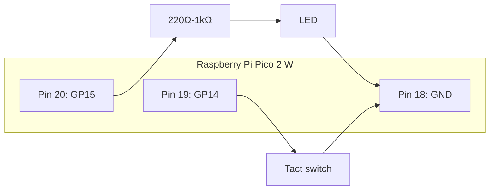

# Cortex-M33 Assembly Hands-On

## Purpose

This hands-on uses the `Cortex-M33` on `Raspberry Pi Pico 2 W with headers` to introduce basic assembly through real hardware behavior.

The goal is to connect:

- C code
- Cortex-M33 instructions
- visible LED and tact switch behavior

## Before You Start

Please read:

- [Cortex-M33 Assembly Primer](lecture02a_cortex_m33_assembly_primer_en.md)

Especially if `ldr`, `str`, `movs`, `orrs`, `bics`, `eors`, or `cbz` are still unclear.

## What We Will Do

1. confirm wiring with a C-only blink sketch
2. open the project containing a `.S` file
3. complete `led_on_asm()` and `led_off_asm()` together with the instructor
4. complete `led_toggle_asm()` individually
5. write the button logic using `CBZ`
6. confirm `UBFX`, `BFI`, `RBIT`, `REV`, and `CLZ`

## Goal

By the end, learners should be able to:

- build a project containing `.S` files in Arduino IDE
- call assembly functions from C
- use `EOR` to toggle LED state
- use `CBZ` for zero-branch logic
- explain `UBFX` and `BFI`
- read the results of `RBIT`, `REV`, and `CLZ`

## Materials

- Raspberry Pi Pico 2 W with headers
- USB cable
- breadboard
- jumper wires
- 1 LED
- 1 resistor between 220 ohms and 1 kohm
- 1 tact switch
- Arduino IDE
- `Arduino-Pico` board package

## Wiring

### LED

- `GP15` -> resistor -> LED anode
- LED cathode -> `GND`

### Tact Switch

- one side -> `GP14`
- opposite side -> `GND`

With `INPUT_PULLUP`, not pressed is `HIGH`, pressed is `LOW`.

### About the 4 Pins of the Tact Switch

The tact switch has 4 leads, but not 4 independent contacts.

- when not pressed:
  - one pair is internally connected
  - the opposite pair is also internally connected
- when pressed:
  - the two pairs connect together
  - effectively all 4 leads conduct together

The common mistake is wiring `GP14` and `GND` to two leads from the same pair. That makes the circuit always connected.

Useful references:

- [SparkFun: Button and Switch Basics](https://learn.sparkfun.com/tutorials/button-and-switch-basics/momentary-switches)
- [HX Switch: How to Identify Tact Switch Pinout](https://www.hx-switch.eu/how-to-identify-tact-switch-pinout/)

### Pico 2 W Physical Pins Used Here

| Signal | Physical Pin | Location |
|---|---:|---|
| `GP14` | 19 | second from the bottom on the left side |
| `GP15` | 20 | bottom-most on the left side |
| `GND` | 18 | third from the bottom on the left side |

Official datasheet:

- <https://pip-assets.raspberrypi.com/categories/1088-raspberry-pi-pico-2-w/documents/RP-008304-DS-2-pico-2-w-datasheet.pdf?disposition=inline>

Check the **layout on page 6** to confirm the positions.

```text
Left lower side
18  GND   <- LED short leg / tact switch return side
19  GP14  <- tact switch signal side
20  GP15  <- LED long leg through resistor
```



## Projects Used in This Class

### Complete Version

- [../projects/pico2w-cortexm33-asm-complete/README.md](../projects/pico2w-cortexm33-asm-complete/README.md)

### Worksheet Version

- [../projects/pico2w-cortexm33-asm-worksheet/README.md](../projects/pico2w-cortexm33-asm-worksheet/README.md)

Students should normally use the worksheet version.

## Getting the Project from GitHub

### Method A: Download ZIP

1. open the GitHub repository in a browser
2. click `Code`
3. select `Download ZIP`
4. unzip it
5. find the project folder used in this class

### Method B: `git clone`

```bash
git clone <repository-url>
```

## Which Folder to Open in Arduino IDE

Open the actual sketch folder, not the repository root.

For this class:

- `pico2w-cortexm33-asm-complete`
- `pico2w-cortexm33-asm-worksheet`

Then open the `.ino` file that has the same name as the folder.

## Editing `led_asm.S`

Arduino IDE can handle `.S` and `.h` files, but many learners find external editors easier for assembly editing.

Recommended workflow:

- edit `led_asm.S` in VS Code or another plain-text editor
- build and upload from Arduino IDE

Keep the extension as **uppercase `.S`**.

## Open the Worksheet

Open:

- [pico2w-cortexm33-asm-worksheet.ino](../projects/pico2w-cortexm33-asm-worksheet/pico2w-cortexm33-asm-worksheet.ino)
- [led_asm.S](../projects/pico2w-cortexm33-asm-worksheet/led_asm.S)

The `.ino` file contains the C-side logic. The main file learners edit is `led_asm.S`.

## Warm-Up: C-Only Blink

```cpp
const int LED_PIN = 15;

void setup() {
  pinMode(LED_PIN, OUTPUT);
}

void loop() {
  digitalWrite(LED_PIN, HIGH);
  delay(300);
  digitalWrite(LED_PIN, LOW);
  delay(300);
}
```

If this does not work, fix the wiring before continuing.

## Joint Hands-On with the Instructor

The first two functions should be completed together with the instructor:

- `led_on_asm()`
- `led_off_asm()`

The goal here is for everyone to successfully:

- open the `.S` file
- replace one instruction
- save
- verify
- upload
- confirm the LED behavior

## Joint Hands-On 1: `led_on_asm()`

Goal:

- make bit 0 of `*state` become 1

Expected result:

- the LED turns on after `led_on_asm()`

## Joint Hands-On 2: `led_off_asm()`

Goal:

- make bit 0 of `*state` become 0

Expected result:

- the LED turns off after `led_off_asm()`

## Individual Exercise 1: `led_toggle_asm()`

This is the main exercise.

Use `EOR` to implement:

```cpp
state ^= 1;
```

Expected result:

- every call toggles the LED state
- two calls restore the original state

## Individual Exercise 2: `should_toggle_on_press_asm()`

Use `CBZ` or `CBNZ` so that the function returns `1` only when the tact switch is pressed.

Expected result:

- the LED toggles only while pressing the tact switch

## Individual Exercise 3: `UBFX`

Implement extraction of 2 bits starting from bit 4.

## Individual Exercise 4: `BFI`

Implement insertion of the low 2 bits of `r1` into `r0` starting at bit 4.

## Individual Exercise 5: `RBIT`

Reverse the bit order and confirm the result in the serial monitor.

## Individual Exercise 6: `REV`

Reverse the byte order and confirm the result in the serial monitor.

## Individual Exercise 7: `CLZ`

Count leading zeros and confirm the result in the serial monitor.

## Recommended Order

1. confirm the C blink
2. open the worksheet
3. `led_on_asm` with the instructor
4. `led_off_asm` with the instructor
5. `led_toggle_asm`
6. `should_toggle_on_press_asm`
7. `ubfx_demo_asm`
8. `bfi_demo_asm`
9. `rbit_demo_asm`
10. `rev_demo_asm`
11. `clz_demo_asm`

## Common Problems

### Build fails

- CPU Architecture must be `ARM Cortex-M33`
- the `.S` extension must stay uppercase

### LED does not move

- confirm the `GP15` wiring
- confirm the LED polarity
- confirm the C-only blink works first

### Button does not react

- confirm the tact switch wiring
- confirm `INPUT_PULLUP`
- remember pressed = `0`

## Compare with the Complete Version

If needed, compare with:

- [../projects/pico2w-cortexm33-asm-complete/led_asm.S](../projects/pico2w-cortexm33-asm-complete/led_asm.S)

## Assignment and Submission Requirements

### Task A: Four Core Functions

Complete:

- `led_on_asm()`
- `led_off_asm()`
- `led_toggle_asm()`
- `should_toggle_on_press_asm()`

Requirements:

- use `EOR` in `led_toggle_asm()`
- use `CBZ` or `CBNZ` in `should_toggle_on_press_asm()`

### Task B: Five Bit-Manipulation Functions

Complete:

- `ubfx_demo_asm()`
- `bfi_demo_asm()`
- `rbit_demo_asm()`
- `rev_demo_asm()`
- `clz_demo_asm()`

### Submission Items

1. `pico2w-cortexm33-asm-worksheet.ino`
2. `led_asm.S`
3. one serial monitor screenshot
4. one short verification memo

### The Memo Must Include

1. the instruction used in `led_toggle_asm()`
2. the branch instruction used in `should_toggle_on_press_asm()`
3. the input and output of `UBFX`
4. the input and output of `BFI`
5. which of `RBIT`, `REV`, or `CLZ` was the most interesting
6. one problem you hit and how you solved it

### Pass Criteria

- the worksheet project compiles
- all 9 functions are implemented
- LED on/off/toggle works on hardware
- the LED toggles only when the tact switch is pressed
- all demo results appear in the serial monitor
