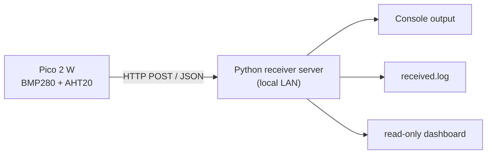

# 第5回 ローカル Python 受信サーバと Pico 側送信コード 仕様書

この資料は、IoT ハンズオンの発展課題として使う、最小の HTTP 受信サーバと `Raspberry Pi Pico 2 W` 側送信コードの仕様を定める。

今回は **実装ではなく仕様の確定** を目的とする。

## 1. 目的

- `Ambient` の代わりに、講義室内のローカルネットワークで完結する受信先を用意する
- 受講生が `HTTP POST` によるデータ送信を体験できるようにする
- 後続の `MTD (Moving Target Defense)` 演習で、送信先パス、送信間隔、トークンなどを変化させられるようにする

## 2. 対象構成

- 送信側: `Raspberry Pi Pico 2 W`
- 開発環境: `Arduino IDE`
- センサ: `BMP280 + AHT20`
- 受信側: `Python 3` で動作する最小 HTTP サーバ
- 接続形態: 同一 Wi-Fi 内のローカル通信

## 3. 全体像



## 4. 受信サーバ仕様

### 4.1 役割

- `HTTP POST` を 1 本受ける
- 受信した JSON を検査する
- 最低限の項目をログへ保存する
- 正常時は `200 OK` を返す
- 受講生が受信結果を確認できる、閲覧専用の簡易ダッシュボードを提供する

### 4.2 実行環境

- `Python 3.10` 以上を推奨
- OS は `Windows` または `macOS`
- 講義用としては 1 台の講師 PC 上で動けばよい

### 4.3 利用ポート

- 既定ポートは `5000`
- 初期実装では `http://<server-ip>:5000/ingest` を使う
- MTD 演習では、`5000` 以外のポートへ変更できる設計にする

### 4.4 エンドポイント

- メソッド: `POST`
- パス: `/ingest`
- `GET /health` は任意実装とする
  - 実装する場合は `200 OK` と簡単な文字列を返せばよい
- `GET /dashboard` を実装する
  - 受信ログの最新内容を、ブラウザで見やすい形で表示する
- `GET /api/messages` は任意実装とする
  - 実装する場合は、ダッシュボード用に最新ログを JSON で返せばよい

### 4.5 リクエストヘッダ

- `Content-Type: application/json`
- `X-Device-Token: <token>` を任意で受け付ける
- 初期実装ではトークンが無くても受理してよい
- MTD 演習ではトークン切替に対応できるよう、受信コード側にトークン確認の差し込み箇所を残す

### 4.6 リクエストボディ

JSON 形式とし、最低限以下のキーを持つ。

```json
{
  "device_id": "pico2w-01",
  "seq": 1,
  "uptime_ms": 12345,
  "temperature_c": 24.8,
  "humidity_pct": 51.2,
  "pressure_hpa": 1008.4
}
```

### 4.7 必須項目

- `device_id`
  - 文字列
  - 受講者ごとに区別できる値
- `seq`
  - 整数
  - 送信回数の連番
- `uptime_ms`
  - 整数
  - 起動からの経過時間
- `temperature_c`
  - 数値
- `humidity_pct`
  - 数値
- `pressure_hpa`
  - 数値

### 4.8 任意項目

- `mode`
  - 例: `fixed`, `mtd-a`, `mtd-b`
- `bmp280_addr`
  - 例: `0x77`
- `send_interval_ms`
- `token_version`

### 4.9 バリデーション

最小受信サーバでは、次の条件だけ確認すればよい。

- JSON としてパースできること
- 必須キーが存在すること
- `seq` と `uptime_ms` が整数であること
- 温度、湿度、気圧が数値であること

不正な場合は以下を返す。

- ステータスコード: `400`
- ボディ例:

```json
{
  "ok": false,
  "error": "missing required field"
}
```

### 4.10 正常レスポンス

正常時は以下を返す。

```json
{
  "ok": true,
  "message": "accepted",
  "server_time": "2026-05-05T10:00:00+09:00"
}
```

### 4.11 ログ仕様

最低限、以下を `received.log` に 1 行 1 JSON で追記する。

- 受信時刻
- 送信元 IP
- `device_id`
- 受信 JSON 全体
- 判定結果 (`accepted` または `rejected`)

ログ例:

```json
{"time":"2026-05-05T10:00:00+09:00","remote_addr":"192.168.10.21","device_id":"pico2w-01","status":"accepted","payload":{"device_id":"pico2w-01","seq":1,"uptime_ms":12345,"temperature_c":24.8,"humidity_pct":51.2,"pressure_hpa":1008.4}}
```

### 4.12 非機能要件

- 講義中に 10 台前後から同時受信できれば十分
- 再起動後もサーバは再実行だけで復旧できること
- データベースは使わない
- ダッシュボードは閲覧専用で十分
- ログ閲覧以外の複雑な画面 UI は不要

### 4.13 ダッシュボード仕様

受講生が「自分のデータが届いたこと」を確認できるよう、最小の閲覧専用ダッシュボードを持つ。

#### 目的

- 受信成功をブラウザで確認できるようにする
- `received.log` を直接開かなくてもよいようにする
- 講師が全体の到達状況を把握しやすくする

#### URL

- `http://<server-ip>:5000/dashboard`

#### 表示内容

最低限、最新 20 件程度の受信記録を表示する。

- 受信時刻
- `device_id`
- 送信元 IP
- `seq`
- `temperature_c`
- `humidity_pct`
- `pressure_hpa`
- `status`

#### フィルタ

最小実装では必須ではないが、可能なら以下があると望ましい。

- `device_id` で絞り込み
- 成功 / 失敗で絞り込み

#### 制約

- ログの編集機能は持たない
- 削除機能は持たない
- 認証は初期版では不要
- JavaScript を使わない単純な HTML でもよい

## 5. Pico 側送信コード仕様

### 5.1 役割

- Wi-Fi に接続する
- センサ値を読み取る
- JSON を組み立てる
- HTTP POST で送信する
- 成功・失敗をシリアルモニタへ表示する

### 5.2 設定項目

ソースコード先頭に、最低限以下の設定項目を持つ。

- `WIFI_SSID`
- `WIFI_PASSWORD`
- `SERVER_HOST`
- `SERVER_PORT`
- `POST_PATH`
- `DEVICE_ID`
- `SEND_INTERVAL_MS`
- `DEVICE_TOKEN` 任意

### 5.3 送信周期

- 初期版は `10,000 ms` 固定でよい
- MTD 版では、たとえば `8,000 ms` から `15,000 ms` の範囲でランダム化できるようにする

### 5.4 送信内容

1 回の送信ごとに以下を含める。

- `device_id`
- `seq`
- `uptime_ms`
- `temperature_c`
- `humidity_pct`
- `pressure_hpa`

### 5.5 シリアル出力

最低限、以下が分かるようにする。

- Wi-Fi 接続開始
- Wi-Fi 接続成功と IP アドレス
- 送信先 URL
- 送信ペイロード
- HTTP ステータスコード
- 成功 / 失敗

出力例:

```text
Wi-Fi connecting...
Wi-Fi connected
Wi-Fi IP: 192.168.10.21
POST http://192.168.10.10:5000/ingest
payload={"device_id":"pico2w-01","seq":1,"uptime_ms":12345,"temperature_c":24.8,"humidity_pct":51.2,"pressure_hpa":1008.4}
HTTP 200
send ok
```

### 5.6 エラー時の振る舞い

- Wi-Fi 未接続なら再接続を試みる
- POST に失敗したらシリアルモニタへ理由を表示する
- 失敗してもデバイスは停止せず、次の周期で再送を試みる

## 6. MTD 向け拡張ポイント

この仕様では、以下の値を後から変更できる構造にする。

- `POST_PATH`
  - 例: `/ingest/a`, `/ingest/b`
- `SERVER_PORT`
  - 例: `5000`, `5001`
- `DEVICE_TOKEN`
  - トークン世代を切り替える
- `SEND_INTERVAL_MS`
  - 固定周期から乱数周期へ変更する
- `mode`
  - 現在の送信モードを JSON に含める

## 7. 講義での導入順

1. 固定パス `/ingest`、固定周期 `10 秒` で動かす
2. サーバ側ログにデータが溜まることを確認する
3. 送信周期をランダム化する
4. パスまたはトークンを切り替える
5. 旧パスや旧トークンを拒否する
6. `固定目標` と `動く目標` の違いを議論する

## 8. 演習での提出条件

### 8.1 受信サーバ側

- Python サーバのソースコード
- `received.log` の抜粋
- 正常受信時のコンソール表示
- ダッシュボード画面のスクリーンショット

### 8.2 Pico 側

- Arduino スケッチ
- シリアルモニタのスクリーンショット
- 1 回以上 `HTTP 200` が返ったことを示す記録

### 8.3 説明文

以下を 3 から 5 行で説明する。

- 固定送信先のままだと何が観測されやすいか
- 今回の仕様で、どのパラメータを MTD に使えるか
- 自分なら最初にどのパラメータを動かすか

## 9. 受け入れ条件

以下を満たしたら、この仕様に沿った最小実装とみなす。

- Pico 2 W からローカルサーバへ `HTTP POST` を送れる
- サーバが JSON を受け取り `200 OK` を返せる
- 受信ログが `received.log` に追記される
- ダッシュボードで最新受信ログを確認できる
- シリアルモニタで送信成否が確認できる
- 将来 `POST_PATH` と `SEND_INTERVAL_MS` を変更しやすい構造になっている

## 10. 今回あえて含めないもの

- HTTPS
- ユーザ管理
- データベース
- 複雑な認証
- 複数センサ基板の自動識別

## 11. 関連資料

- [lecture01_iot_security_pico2w.md](lecture01_iot_security_pico2w.md)
- [lecture04_cortex_m33_vs_hazard3.md](lecture04_cortex_m33_vs_hazard3.md)
