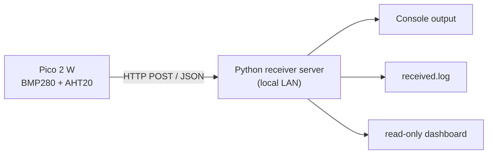

# Lecture 5: Specification for a Local Python Receiver Server and Pico Sender Code

This document defines the specification for a minimal HTTP receiver server and `Raspberry Pi Pico 2 W` sender code as an advanced extension of the IoT hands-on.

The goal here is to **fix the specification first, not to implement it yet**.

## 1. Goal

- Replace `Ambient` with a local receiver inside the classroom network
- Let learners experience `HTTP POST` based telemetry
- Prepare for later `MTD (Moving Target Defense)` exercises by making the destination path, interval, and token configurable

## 2. Target Setup

- Sender: `Raspberry Pi Pico 2 W`
- IDE: `Arduino IDE`
- Sensors: `BMP280 + AHT20`
- Receiver: minimal HTTP server written in `Python 3`
- Network: local communication inside the same Wi-Fi

## 3. Overview



## 4. Receiver Server Specification

### 4.1 Role

- Accept one `HTTP POST`
- Validate the received JSON
- Store the minimum required log fields
- Return `200 OK` on success
- Provide a simple read-only dashboard so learners can confirm that their messages were received

### 4.2 Runtime

- `Python 3.10` or newer is recommended
- `Windows` or `macOS`
- For classroom use, one instructor PC is enough

### 4.3 Port

- Default port: `5000`
- Initial endpoint: `http://<server-ip>:5000/ingest`
- For MTD exercises, the design should allow switching to a different port later

### 4.4 Endpoint

- Method: `POST`
- Path: `/ingest`
- `GET /health` is optional
  - If implemented, returning `200 OK` with a short message is enough
- Implement `GET /dashboard`
  - It should display the latest received log entries in a browser-friendly format
- `GET /api/messages` is optional
  - If implemented, it may return recent log entries as JSON for the dashboard

### 4.5 Request Headers

- `Content-Type: application/json`
- `X-Device-Token: <token>` may be accepted
- The initial version may accept requests even without a token
- For later MTD exercises, leave a clear insertion point for token validation

### 4.6 Request Body

Use JSON with at least the following keys.

```json
{
  "device_id": "pico2w-01",
  "seq": 1,
  "uptime_ms": 12345,
  "temperature_c": 24.8,
  "humidity_pct": 51.2,
  "pressure_hpa": 1008.4
}
```

### 4.7 Required Fields

- `device_id`
  - string
  - should identify each learner or device
- `seq`
  - integer
  - sequential send counter
- `uptime_ms`
  - integer
  - milliseconds since boot
- `temperature_c`
  - numeric
- `humidity_pct`
  - numeric
- `pressure_hpa`
  - numeric

### 4.8 Optional Fields

- `mode`
  - for example: `fixed`, `mtd-a`, `mtd-b`
- `bmp280_addr`
  - for example: `0x77`
- `send_interval_ms`
- `token_version`

### 4.9 Validation

The minimal receiver only needs to check:

- the body can be parsed as JSON
- all required keys exist
- `seq` and `uptime_ms` are integers
- temperature, humidity, and pressure are numeric

If invalid, return:

- status code: `400`
- response body example:

```json
{
  "ok": false,
  "error": "missing required field"
}
```

### 4.10 Success Response

On success, return:

```json
{
  "ok": true,
  "message": "accepted",
  "server_time": "2026-05-05T10:00:00+09:00"
}
```

### 4.11 Logging

Append one JSON object per line to `received.log` with at least:

- receive time
- source IP
- `device_id`
- full received JSON
- result (`accepted` or `rejected`)

Example:

```json
{"time":"2026-05-05T10:00:00+09:00","remote_addr":"192.168.10.21","device_id":"pico2w-01","status":"accepted","payload":{"device_id":"pico2w-01","seq":1,"uptime_ms":12345,"temperature_c":24.8,"humidity_pct":51.2,"pressure_hpa":1008.4}}
```

### 4.12 Non-Functional Requirements

- Handling about 10 concurrent classroom devices is enough
- Restarting the server process should be enough for recovery
- No database
- A read-only dashboard is enough
- No complex UI beyond log viewing is required

### 4.13 Dashboard Specification

To let learners confirm that their data reached the server, provide a minimal read-only dashboard.

#### Goal

- Make reception success visible in a browser
- Avoid requiring learners to open `received.log` directly
- Help the instructor see overall classroom progress

#### URL

- `http://<server-ip>:5000/dashboard`

#### Displayed Data

Show at least the latest 20 entries or so.

- receive time
- `device_id`
- source IP
- `seq`
- `temperature_c`
- `humidity_pct`
- `pressure_hpa`
- `status`

#### Filtering

Not required for the minimum version, but desirable if easy to add.

- filter by `device_id`
- filter by success or failure

#### Constraints

- no log editing
- no delete function
- no authentication in the initial version
- plain HTML without JavaScript is acceptable

## 5. Pico Sender Code Specification

### 5.1 Role

- Connect to Wi-Fi
- Read sensor values
- Build a JSON payload
- Send it with HTTP POST
- Print success or failure to the serial monitor

### 5.2 Configuration Items

Define at least the following near the top of the source code.

- `WIFI_SSID`
- `WIFI_PASSWORD`
- `SERVER_HOST`
- `SERVER_PORT`
- `POST_PATH`
- `DEVICE_ID`
- `SEND_INTERVAL_MS`
- `DEVICE_TOKEN` optional

### 5.3 Send Interval

- The initial version may use a fixed `10,000 ms`
- The MTD version should later allow randomization, for example between `8,000 ms` and `15,000 ms`

### 5.4 Payload Contents

Each send should include:

- `device_id`
- `seq`
- `uptime_ms`
- `temperature_c`
- `humidity_pct`
- `pressure_hpa`

### 5.5 Serial Output

At minimum, the serial monitor should show:

- Wi-Fi connection start
- Wi-Fi success and IP address
- destination URL
- payload
- HTTP status code
- success or failure

Example:

```text
Wi-Fi connecting...
Wi-Fi connected
Wi-Fi IP: 192.168.10.21
POST http://192.168.10.10:5000/ingest
payload={"device_id":"pico2w-01","seq":1,"uptime_ms":12345,"temperature_c":24.8,"humidity_pct":51.2,"pressure_hpa":1008.4}
HTTP 200
send ok
```

### 5.6 Error Handling

- If Wi-Fi is disconnected, try reconnecting
- If POST fails, print the reason to the serial monitor
- The device should not stop permanently; it should try again on the next cycle

## 6. MTD Extension Points

This specification should support changing the following later:

- `POST_PATH`
  - for example: `/ingest/a`, `/ingest/b`
- `SERVER_PORT`
  - for example: `5000`, `5001`
- `DEVICE_TOKEN`
  - rotate token generations
- `SEND_INTERVAL_MS`
  - move from a fixed period to a randomized period
- `mode`
  - include the current sending mode in the JSON payload

## 7. Recommended Classroom Order

1. Start with fixed path `/ingest` and fixed interval `10 seconds`
2. Confirm that the server log receives data
3. Randomize the send interval
4. Switch the path or token
5. Reject the old path or old token
6. Discuss the difference between a fixed target and a moving target

## 8. Submission Requirements

### 8.1 Receiver Side

- Python server source code
- excerpt from `received.log`
- console output showing successful reception
- screenshot of the dashboard page

### 8.2 Pico Side

- Arduino sketch
- screenshot of the serial monitor
- evidence that `HTTP 200` was received at least once

### 8.3 Short Explanation

Explain the following in 3 to 5 lines:

- what is easy to observe when the destination remains fixed
- which parameters in this design can be used for MTD
- which parameter you would move first

## 9. Acceptance Criteria

The minimal implementation is accepted if:

- Pico 2 W can send an `HTTP POST` to the local server
- the server can receive JSON and return `200 OK`
- the server appends reception records to `received.log`
- the dashboard can display recent received messages
- the serial monitor clearly shows success or failure
- the code structure makes future changes to `POST_PATH` and `SEND_INTERVAL_MS` easy

## 10. Intentionally Out of Scope

- HTTPS
- user management
- database integration
- complex authentication
- automatic multi-sensor board detection

## 11. Related Materials

- [lecture01_iot_security_pico2w_en.md](lecture01_iot_security_pico2w_en.md)
- [lecture04_cortex_m33_vs_hazard3_en.md](lecture04_cortex_m33_vs_hazard3_en.md)
